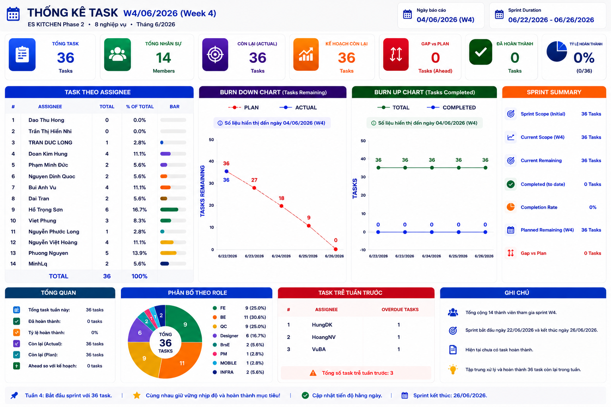

# Hướng dẫn tạo Daily Report tổng quan (bằng hình ảnh Dashboard)

Dùng **Claude + prompt sẵn** để biến dữ liệu task thô (Excel) thành **01 ảnh dashboard infographic** phong cách PMO/Executive Report — có KPI, biểu đồ **Burn Down / Burn Up**, phân bố theo role, task overdue... **Không cần vẽ tay, không cần dùng Power BI**.

## Ví dụ đầu ra



> Ảnh trên là đầu ra thật của prompt — 1 dashboard duy nhất, tỉ lệ 16:9, đọc được ngay như slide báo cáo.

---

## Đầu vào & Đầu ra

**Đầu vào:**
- Dữ liệu task đã cập nhật của sprint (dán từ file Excel `Monitor_template.xlsx`)
- Prompt gốc `Prompt_Task_Dashboard.md`

**Đầu ra:**
- **01 ảnh dashboard duy nhất** (không phải bảng markdown), phong cách infographic hiện đại, gồm 6 khối chính + KPI hàng trên + footer nhận xét tự động.

---

## Chuẩn bị (làm 1 lần)

Có sẵn 2 file trong folder này:

- 📄 [`Prompt_Task_Dashboard.md`](./Prompt_Task_Dashboard.md) — prompt gốc để dán vào Claude
- 📊 [`Monitor_template.xlsx`](./Monitor_template.xlsx) — template Excel để ghi dữ liệu task hằng ngày

Copy 2 file này về máy → điền dữ liệu vào Excel → mỗi ngày chỉ cần dán data + prompt là ra dashboard.

---

## Flow sử dụng (mỗi ngày)

### Bước 1 — Cập nhật dữ liệu vào Excel
Mở `Monitor_template.xlsx`, cập nhật:
- **Danh sách task** theo Assignee (cột TOTAL)
- **BURN DOWN:** cột `ACTUAL` (task còn lại thực tế) + `PLAN` (kế hoạch)
- **BURN UP:** cột `TOTAL` (tổng scope) + `COMPLETED` (đã xong)
- **Danh sách task overdue** (nếu có)

### Bước 2 — Copy dữ liệu ra text
Copy dữ liệu từ Excel theo format prompt yêu cầu:

```text
Thống kê task

Assignee    TOTAL
...

BURN DOWN
ACTUAL
PLAN

BURN UP
TOTAL
COMPLETED

Danh sách task overdue
...
```

### Bước 3 — Mở Claude và dán prompt + dữ liệu
1. Mở [Claude](https://claude.ai) → tạo chat mới (nên **bật project** riêng cho từng dự án).
2. **Dán toàn bộ nội dung** `Prompt_Task_Dashboard.md` vào ô chat.
3. Dán tiếp **dữ liệu** đã copy ở Bước 2 xuống dưới.
4. Gửi → Claude sẽ tự phân tích, tính KPI, dựng chart và **xuất ra 1 ảnh dashboard hoàn chỉnh**.

> 💡 **Mẹo:** lưu prompt vào **Project instructions** của Claude — mỗi ngày chỉ cần dán dữ liệu là ra ảnh, không phải dán lại prompt.

---

## Cấu trúc dashboard mà prompt sinh ra

| Vùng | Nội dung |
|---|---|
| **Header** | Tên sprint · Ngày báo cáo · Thời gian sprint · Logo `ES KITCHEN Phase 2` |
| **Hàng KPI trên cùng** | Tổng task · Tổng nhân sự · Còn lại (Actual) · Kế hoạch còn lại (Plan) · Gap vs Plan · Đã hoàn thành · Tỷ lệ hoàn thành |
| **Khối 1 — Task theo Assignee** | Cột dọc nhiều màu, sắp giảm dần theo TOTAL, hiển thị Top 3 nổi bật |
| **Khối 2 — Burn Down** | Đường PLAN (đỏ nét đứt) vs ACTUAL (xanh). ACTUAL chỉ vẽ đến ngày hiện tại |
| **Khối 3 — Burn Up** | Đường TOTAL (xanh lá) vs COMPLETED (xanh dương). COMPLETED chỉ vẽ đến ngày hiện tại |
| **Khối 4 — Sprint Summary** | Sprint Scope · Current Scope · Current Remaining · Completed · Completion Rate · Gap vs Plan |
| **Khối 5 — Phân bố theo Role** | Donut chart: BrsE / PM / Designer / BE / FE / Mobile / QC / INFRA — kèm số task và % |
| **Khối 6 — Task Overdue** | Bảng Assignee → Số task trễ · KPI: Total Overdue · Affected Members · Highest Risk Owner *(ẩn nếu không có data)* |
| **Footer** | Tổng số thành viên · Ngày kết thúc sprint · **Nhận xét tự động** dựa trên Gap vs Plan |

---

## Công thức KPI (Claude tự tính, không cần làm thủ công)

```text
Total Members     = số assignee có trong bảng
Current Remaining = giá trị ACTUAL mới nhất
Planned Remaining = giá trị PLAN cùng ngày
Gap               = Actual − Plan
Completed         = Current Scope − Current Remaining
Completion Rate   = Completed / Current Scope × 100%
```

Nếu không cung cấp `COMPLETED` → tự tính `COMPLETED = TOTAL − ACTUAL`.

---

## Quy tắc quan trọng (đã ghi trong prompt)

- ✅ **Không vẽ dữ liệu tương lai** — ACTUAL và COMPLETED chỉ vẽ đến ngày hiện tại có data.
- ✅ **Luôn vẽ full PLAN và TOTAL** dù sprint chưa xong.
- ✅ Nếu **TOTAL thay đổi giữa sprint** → Burn Up phải phản ánh thay đổi scope.
- ✅ Cho phép **COMPLETED âm** ở ngày đầu nếu backlog tăng.
- ❌ **Không** trả về bảng markdown — chỉ xuất **1 ảnh duy nhất**.
- ❌ **Không hỏi lại** — tự phân tích và render luôn.

---

## Tips để dashboard đẹp và đọc được

- **Rút gọn tên** nếu assignee quá dài → tránh vỡ layout cột.
- **Đặt tên sprint và ngày báo cáo** rõ ràng ở header — người xem biết ngay đang xem báo cáo nào.
- Chạy vào **cuối ngày làm việc** (17h–18h) → data ổn định, dashboard đại diện đúng cho ngày đó.
- Lưu ảnh ra folder Drive chung của dự án theo tên `Dashboard_YYYY-MM-DD.png` để tra ngược lịch sử.

---

## 📎 File đính kèm trong folder này

- [`Prompt_Task_Dashboard.md`](./Prompt_Task_Dashboard.md) — prompt gốc, dán vào Claude
- [`Monitor_template.xlsx`](./Monitor_template.xlsx) — template Excel để nhập dữ liệu task hằng ngày
- [`images/example-dashboard.png`](./images/example-dashboard.png) — ảnh mẫu đầu ra
