# Hướng dẫn tạo Slack Daily Report bằng AI (Claude)

Tự động hóa **báo cáo Slack hằng ngày** cho dự án phần mềm có khách hàng nước ngoài: Claude quét Slack theo lịch, phát hiện item đang bị treo, xuất file Excel và lưu lên Google Drive.

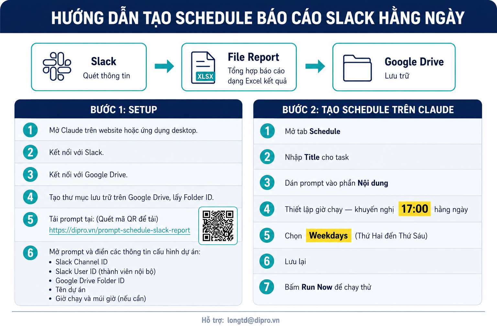

---

## Mục tiêu

- **Đầu vào:** message trong các channel Slack của dự án + cấu hình dự án (kênh, thành viên nội bộ, thư mục Drive...)
- **Đầu ra:** file `Slack_Daily_YYYY-MM-DD.xlsx` gồm 4 mục (Hoạt động trong ngày · Trạng thái item · Nội dung đã thống nhất · File đính kèm) — tự động lưu lên Google Drive.
- **Tần suất:** chạy tự động các ngày làm việc (mặc định 17:00 giờ Việt Nam).

---

## BƯỚC 1 — SETUP (làm 1 lần)

### 1.1. Kết nối Slack với Claude
Mở Claude → **Connectors** → **Slack** → **Connect** → đăng nhập trong tab mới.

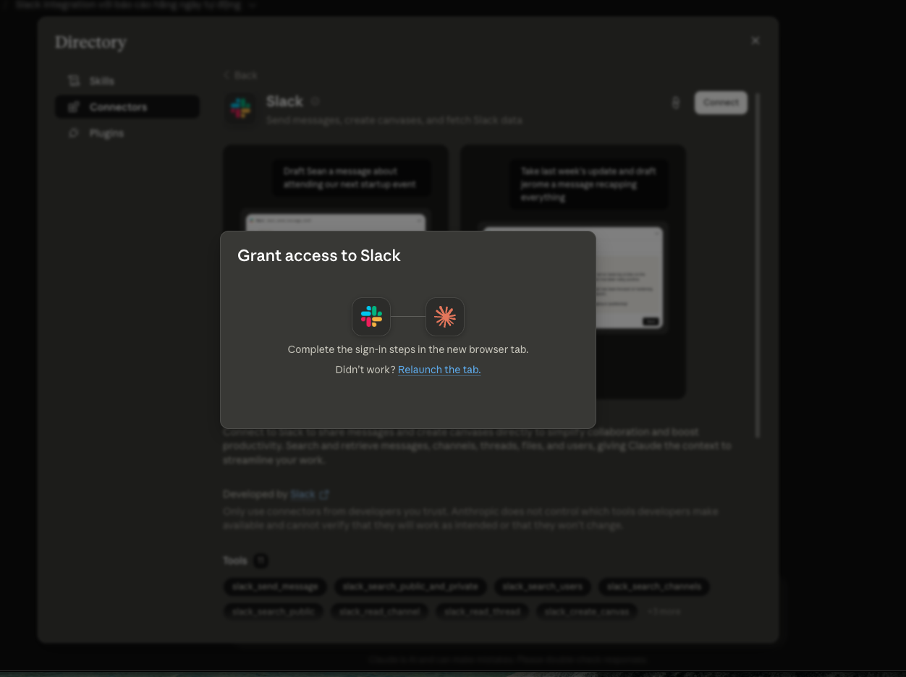

Chọn đúng **Workspace** của dự án và bấm **Allow**.

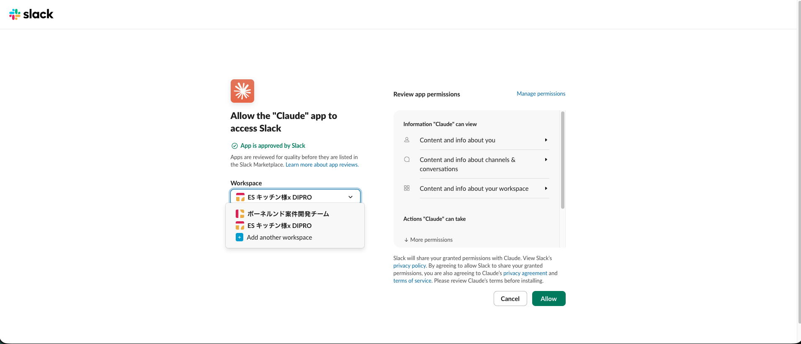

### 1.2. Kết nối Google Drive với Claude
Trong **Connectors** → tìm **Google Drive** → **Connect** → đăng nhập tài khoản Google.

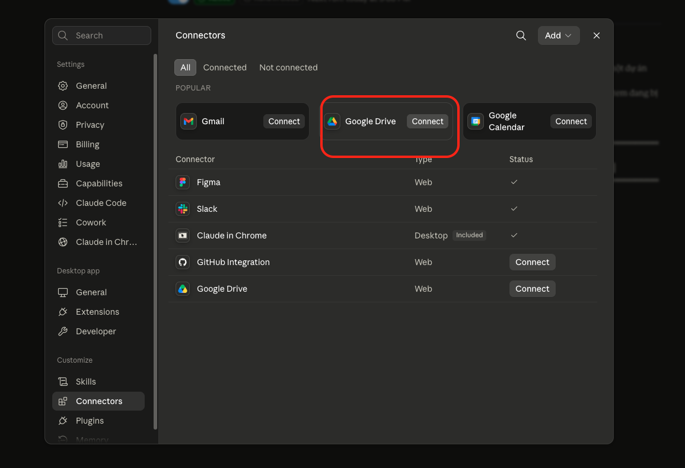

### 1.3. Cấu hình quyền cho Google Drive
Vào chi tiết connector Google Drive → **Tool permissions** → **tắt** 2 quyền không cần (giảm rủi ro):
- **Download file content** — không cho tải nội dung file về
- **Copy file** — không cho copy file

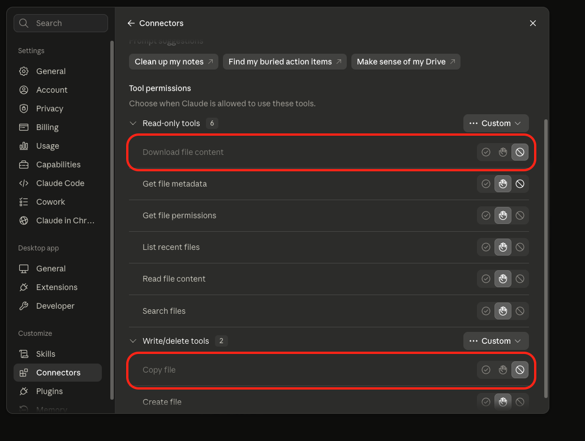

### 1.4. Tạo folder Drive và lấy Folder ID
- Tạo thư mục Drive để chứa báo cáo. **Nên tạo trong Shared Drive của dự án** (không dùng My Drive cá nhân — khi người nghỉ việc sẽ mang theo quyền truy cập).
- **Share** folder với đầy đủ thành viên cần xem, bấm **Copy link** để lấy Folder ID (phần sau `/folders/` trong URL).

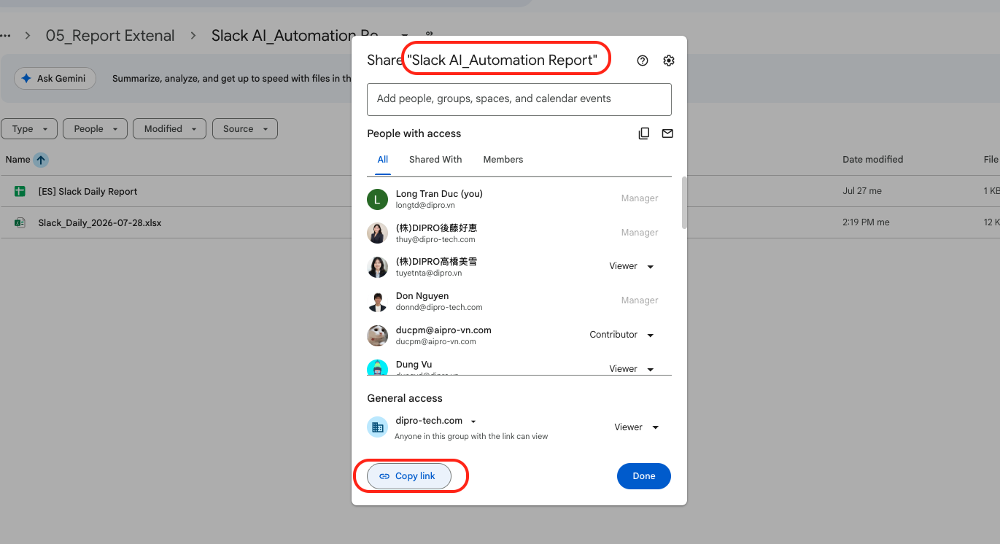

### 1.5. Tải prompt về máy
Tải prompt gốc `Prompt_Slack_Daily_Report.md` từ Google Drive (hoặc scan QR bên dưới).

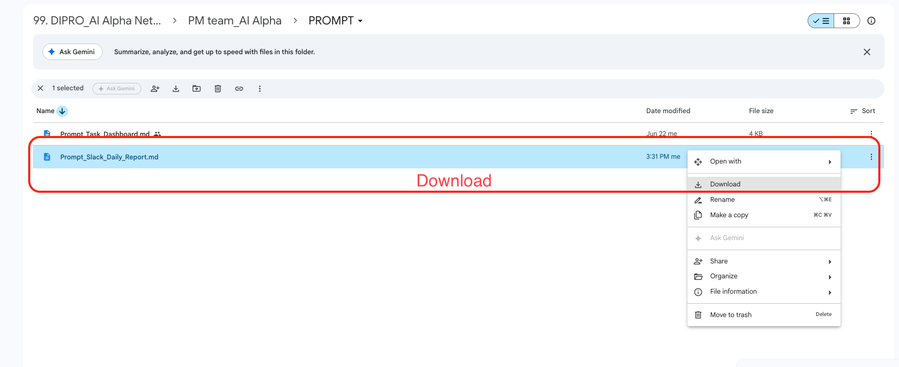

📱 **QR để lấy prompt nhanh:**

> 📄 Bản prompt gốc cũng đã lưu ngay trong folder này: [`Prompt_Slack_Daily_Report.md`](./Prompt_Slack_Daily_Report.md)

### 1.6. Điền cấu hình dự án vào prompt
Mở file `Prompt_Slack_Daily_Report.md` bằng editor bất kỳ, **điền khối CẤU HÌNH DỰ ÁN** ở đầu file:

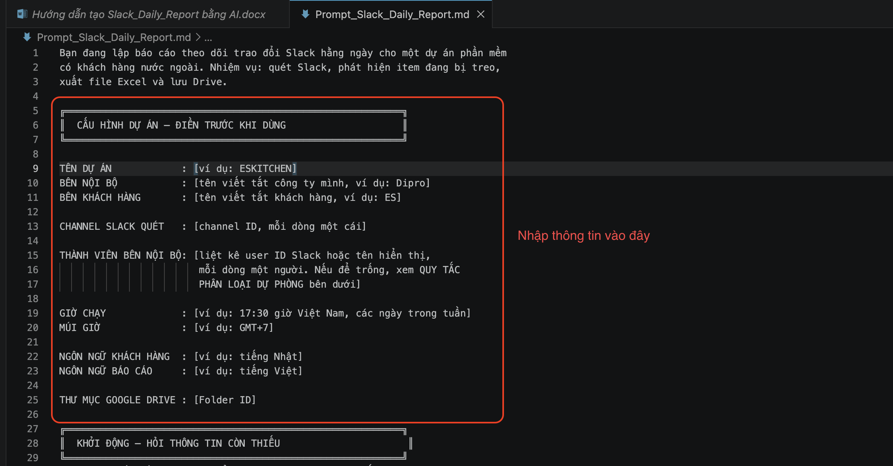

| Trường | Nhập gì |
|---|---|
| `TÊN DỰ ÁN` | Ví dụ: `ESKITCHEN` |
| `BÊN NỘI BỘ` | Viết tắt công ty mình, ví dụ: `Dipro` |
| `BÊN KHÁCH HÀNG` | Viết tắt khách hàng, ví dụ: `ES` |
| `CHANNEL SLACK QUÉT` | Channel ID, mỗi dòng một cái |
| `THÀNH VIÊN BÊN NỘI BỘ` | User ID Slack hoặc tên hiển thị, mỗi dòng một người |
| `GIỜ CHẠY` | Ví dụ: `17:30 giờ Việt Nam, các ngày trong tuần` |
| `MÚI GIỜ` | Ví dụ: `GMT+7` |
| `NGÔN NGỮ KHÁCH HÀNG` | Ví dụ: `tiếng Nhật` |
| `NGÔN NGỮ BÁO CÁO` | Ví dụ: `tiếng Việt` |
| `THƯ MỤC GOOGLE DRIVE` | Folder ID lấy ở bước 1.4 |

---

## BƯỚC 2 — TẠO SCHEDULE TRÊN CLAUDE

### 2.1. Mở Scheduled Tasks
Truy cập: <https://claude.ai/scheduled-task>

Bấm **New task** → chọn **Set up manually**.

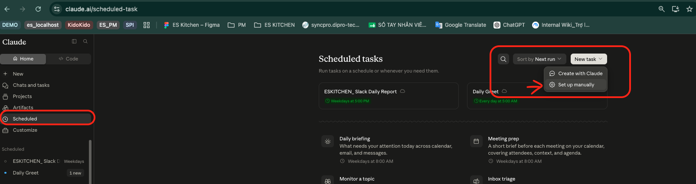

### 2.2. Điền thông tin task
Trong hộp thoại **Edit scheduled task**:

- **Name:** đặt theo mẫu `<TÊN DỰ ÁN>_Slack Daily Report` (ví dụ: `ESKITCHEN_Slack Daily Report`)
- **Nội dung:** **dán toàn bộ prompt** (đã điền cấu hình ở Bước 1.6) vào ô nội dung
- **Project:** chọn project tương ứng
- **Model:** `Sonnet` (khuyến nghị — task cần phân loại + viết báo cáo dài)
- **Mode:** `Automatically approve`
- **Frequency:** `Weekdays`
- **Time:** `17:00` (hoặc giờ trong cấu hình)

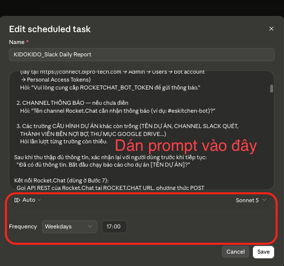

Bấm **Save**.

### 2.3. Kích hoạt & chạy thử
Task tạo xong sẽ ở trạng thái **Active** — bấm **Run now** để chạy thử ngay và kiểm tra file đầu ra.

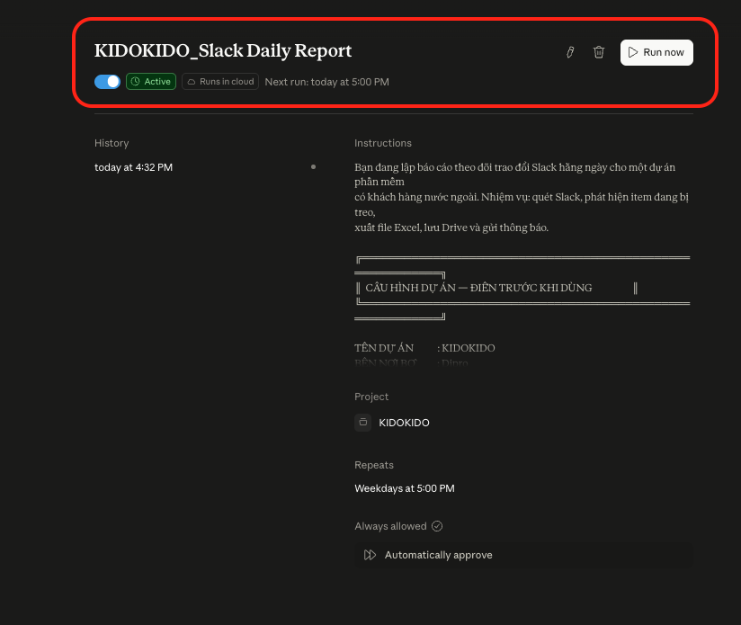

---

## CHUẨN BỊ CHO MỖI DỰ ÁN MỚI

| # | Việc |
|---|---|
| 1 | Điền toàn bộ khối **CẤU HÌNH DỰ ÁN** trong prompt |
| 2 | Tạo thư mục Google Drive, lấy Folder ID (**nên đặt trong Shared Drive** của dự án) |
| 3 | Bật connector Google Drive |
| 4 | Lấy user ID Slack của thành viên nội bộ điền vào cấu hình |
| 5 | Tạo scheduled task: `Weekdays`, đúng giờ trong cấu hình |
| 6 | Chạy thử **Run now**, so file kết quả với file mẫu |
| 7 | Chỉ bật lịch khi bản chạy tay đạt yêu cầu |

---

## THỬ KỊCH BẢN HỎNG

Sau khi chạy thành công, **chủ động thử cho hỏng** để xem phần tự kiểm tra có "nổ" không:

- Đổi tạm channel ID thành ID không tồn tại → tổng kết task phải ghi **LỖI**
- Đặt cửa sổ vào khoảng chắc chắn không có message → tổng kết phải ghi **CẢNH BÁO**, không phải OK

Nếu hai trường hợp trên vẫn báo `OK` thì phần tự kiểm tra chưa hoạt động — cần sửa prompt.

---

## KIỂM CHỨNG SAU LẦN CHẠY ĐẦU

- **Danh sách thành viên nội bộ đúng chưa** — xem cột "Bên đang được chờ" ở Mục 2. Sai một người là lệch toàn bộ phân loại.
- **Cửa sổ thời gian đúng chưa** — đối chiếu message đầu và cuối với Slack.
- **Ngày làm việc đầu tuần có lấy được tin cuối tuần không** — phải chạy vào đúng ngày đó mới biết.
- **Task có chạy khi máy tắt không** — tắt máy một hôm rồi kiểm tra (task chạy trên cloud, không phụ thuộc máy local).

---

## GIỚI HẠN ĐÃ BIẾT

- Connector Drive **không ghi đè**. Chạy hai lần trong ngày ra hai file trùng tên chứ không thay thế. Nếu phiền, thêm giờ vào tên file.
- Connector Drive **không** thêm được tab vào Google Sheet có sẵn. Muốn vậy phải dùng custom MCP server có quyền ghi Sheets.
- Lần chạy đầu quét 60 ngày và chưa có file cũ để đối chiếu → sẽ **lâu hơn** hẳn. Nếu timeout, chạy tay lại với 30 ngày; từ hôm sau cơ chế chuyển tiếp sẽ gánh phần còn lại.

---

## 📎 File đính kèm trong folder này

- [`Prompt_Slack_Daily_Report.md`](./Prompt_Slack_Daily_Report.md) — prompt gốc để dán vào scheduled task
- [`images/`](./images/) — toàn bộ screenshot hướng dẫn từng bước
