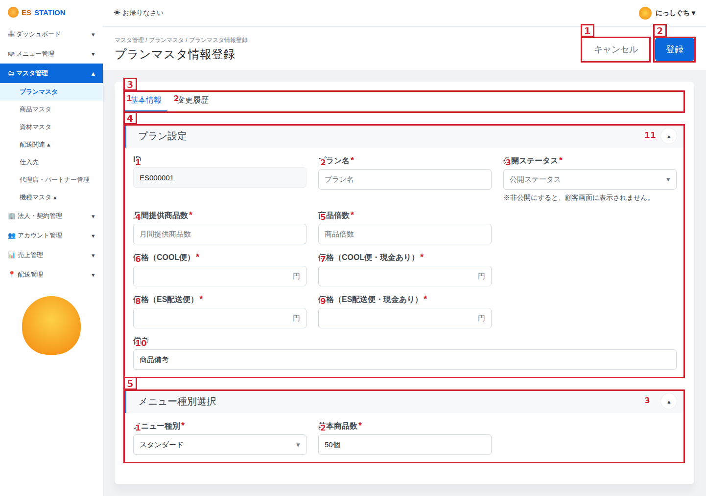

# Hướng dẫn tạo Basic-Design (画面設計書) bằng Claude + Figma

Dùng **Claude Desktop + Figma Desktop (MCP)** để tự sinh **画面設計書** cho từng màn hình từ Figma có sẵn.

**Output mỗi lần chạy:**
- 🖼️ **01 ảnh screen đã đánh số** (annotated PNG)
- 📊 **01 file Excel** mô tả từng phần tử theo template dự án

## Ảnh output mẫu

## 🎬 Video demo

<https://drive.google.com/file/d/1tNFrWrgl2jDM5fpACFwGb_wdXkzZ7Ose/view?usp=sharing>

---

> **Lưu ý:** Bước 1 và Bước 2 chỉ làm **một lần** cho mỗi máy. Sau đó mỗi lần dùng chỉ chạy **Bước 3**.

## BƯỚC 1 — Cài đặt & kết nối (1 lần)

1. Cài **Claude Desktop:** <https://claude.com/download>
2. Cài **Figma Desktop:** <https://www.figma.com/downloads/>
3. Đăng nhập Claude + Figma, mở dự án cần làm.
4. Trong Claude gõ: *"Kết nối với MCP Figma giúp tôi, tôi đang mở ứng dụng Figma có sẵn."*

## BƯỚC 2 — Nạp prompt & template (1 lần)

**Kéo 3 file** sau vào cửa sổ Claude:

- 📄 [`PROMPT_detail_design.md`](./PROMPT_detail_design.md) — prompt gốc (nhớ điền khối `CẤU HÌNH` theo dự án bạn trước khi kéo)
- 📊 [`template_detail_design.xlsx`](./template_detail_design.xlsx) — template Excel
- 🖼️ [`images/template_numbered_example.png`](./images/template_numbered_example.png) — ảnh mẫu để Claude học convention đánh số

## BƯỚC 3 — Sử dụng (mỗi lần)

### Cách 1 — Từ Figma trực tiếp (nhanh)
1. Trong Figma Desktop, chọn Node/Frame → **Copy Link to Selection**
2. Trong Claude gõ: *"Tạo Detail Design cho tôi từ URL này: `<dán link>`"*

### Cách 2 — Từ ảnh export + spec (chính xác hơn)
Dùng khi cần Claude đọc thêm spec khách hàng, không chỉ Figma:
1. Trong Figma chọn SCREEN → **Export to PNG**
2. Upload 2 file vào Claude: `<file_spec>` + `<ảnh PNG vừa export>`
3. Gõ: *"Tạo Detail Design cho tôi từ thông tin này"*

---

## Chuẩn bị input đầy đủ cho 1 màn

| Thông tin | Ví dụ |
|---|---|
| Figma node URL | `https://www.figma.com/design/.../?node-id=...` |
| Screen code / tên | `<SCREEN_CODE> / <tên nguồn> / <tên đích>` |
| 機能 (function group) | `<tên nhóm chức năng>` |
| Epic | `<epic dự án>` |

Nếu cần thêm màn (đăng ký / chi tiết / sửa / popup) → gửi tiếp node URL của các frame đó.

## 📎 File trong folder này

- [`PROMPT_detail_design.md`](./PROMPT_detail_design.md) — prompt gốc (điền `CẤU HÌNH` trước khi dùng)
- [`template_detail_design.xlsx`](./template_detail_design.xlsx) — template Excel
- [`images/template_numbered_example.png`](./images/template_numbered_example.png) — ảnh mẫu đánh số
