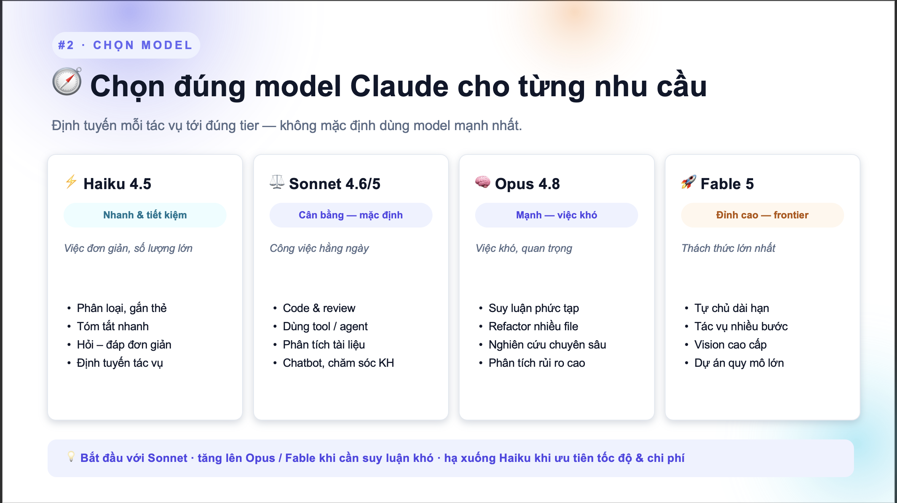

# Mẹo chọn Model AI cho phù hợp (Skill · Agent · Model setup cho KIT)

Hướng dẫn cấu hình **Skill / Agent / Model** trong bộ KIT sao cho **đúng — nhanh — tiết kiệm token**. Model là một trong các tác nhân **tiêu thụ token nhanh nhất** — chọn sai tier là cost bay ngay.



---

## 1. Cấu hình trong `agent.md` / `skill.md`

Mỗi file agent/skill **nên** khai báo đủ các phần:

```yaml
---
name: <ten-agent-hoac-skill>
description: <mô tả ngắn — quyết định khi nào AI load file này>
tools:
  - Read
  - Grep
  - Glob
  - Bash
model: sonnet   # hoặc: haiku | opus | fable
---
```

### Nguyên tắc

| Mục | Nguyên tắc |
|---|---|
| **Tools** | Mỗi role cần tool gì để làm đúng việc — **không thừa, không thiếu**. Thừa tool → AI dễ chọn nhầm, tốn token; thiếu tool → không làm được việc. |
| **Model** | Chọn theo **độ phức tạp của QUYẾT ĐỊNH**, không phải độ phức tạp của TASK. Viết 500 dòng code không cần Opus nếu prompt đã rõ; ngược lại 1 câu hỏi kiến trúc mơ hồ có thể cần Opus. |

---

## 2. Liên kết Skill vào Command / Agent

`command.md` và `agent.md` **cần khai báo rõ `skill.md` tương ứng** → mỗi lần chạy sẽ load đúng skill, **tránh AI tự đoán mò** trong danh sách `skills/`.

Ví dụ trong `agent.md`:
```markdown
## Đọc thêm
- Skill chính: `.claude/skills/react-expert/SKILL.md`
- Rule dự án: `.claude/rules/coding-style.md`
```

Nếu không khai báo, AI sẽ **tự chọn skill** dựa trên tên — dễ nhầm giữa các skill gần giống (`react-expert` vs `react-native-expert` vs `react-testing`).

---

## 3. Lợi ích khi làm đúng

- ✅ **Đúng đắn** — dùng đúng thứ cần dùng
- ⚡ **Hiệu quả** — chạy nhanh, gọn hơn
- 💰 **Token hợp lý** — chọn cái *phù hợp nhất*, không phải cái *"tốt nhất"*

> ⚠️ **Nhắc lại:** Model là **1 trong các tác nhân TIÊU THỤ NHANH HẾT TOKEN NHẤT.** Mặc định dùng Opus/Fable cho mọi thứ = cháy quota trong vài giờ.

---

## 4. Tips — chọn model đúng cách

### 🎯 Bảng chọn nhanh

| Tier | Khi nào dùng | Ví dụ tác vụ |
|---|---|---|
| ⚡ **Haiku 4.5** — *Nhanh & tiết kiệm* | Việc đơn giản, số lượng lớn | Phân loại · gắn thẻ · tóm tắt · hỏi–đáp đơn giản · định tuyến task |
| ⚖️ **Sonnet 4.6/5** — *Cân bằng, mặc định* | Công việc hằng ngày | **Code & review** · dùng tool/agent · phân tích tài liệu · chatbot CSKH |
| 🧠 **Opus 4.8** — *Mạnh, việc khó* | Việc khó, quan trọng | Suy luận phức tạp · refactor nhiều file · nghiên cứu chuyên sâu · phân tích rủi ro |
| 🚀 **Fable 5** — *Đỉnh cao, frontier* | Thách thức lớn nhất | Tự chủ dài hạn · tác vụ nhiều bước · vision cao cấp · dự án quy mô lớn |

> 💡 **Nguyên tắc chung:** *Bắt đầu với **Sonnet** · tăng lên **Opus/Fable** khi cần suy luận khó · hạ xuống **Haiku** khi ưu tiên tốc độ & chi phí.*

### ❌ Sai lầm phổ biến

> "Task này viết nhiều code → phải dùng Opus."

**Sai.** Vì:

- **Code generation = thực thi**, không phải suy luận → **Sonnet viết code tốt ngang Opus** trong hầu hết trường hợp.
- **Opus chỉ thắng** khi phải **tự đặt câu hỏi và tự trả lời** mà prompt không cung cấp đủ context (kiến trúc mơ hồ, trade-off khó, debug bug tầng sâu).

### ✅ Cách chọn đúng — hỏi 3 câu

1. **Prompt có đủ context không?** Có → Sonnet đủ. Không → cân nhắc Opus.
2. **AI có cần tự đặt câu hỏi & tự trả lời không?** Có → Opus. Không → Sonnet/Haiku.
3. **Có phải batch việc lặp lại nhiều lần không?** Có → **Haiku** (tiết kiệm token đáng kể).

---

## 5. Ví dụ áp dụng trong KIT

```yaml
# .claude/agents/frontend-agent.md
---
name: frontend-agent
description: React FE developer cho E02/E03 — implement component, hook, store.
tools: [Read, Edit, Write, mcp__tilth__tilth_search, mcp__tilth__tilth_read]
model: sonnet   # code generation → Sonnet là đủ
---
```

```yaml
# .claude/agents/architect-agent.md
---
name: architect-agent
description: Thiết kế kiến trúc hệ thống, phân tích trade-off giữa nhiều phương án.
tools: [Read, Grep, Glob, WebFetch]
model: opus     # cần suy luận & tự đặt câu hỏi → Opus
---
```

```yaml
# .claude/agents/tagger-agent.md
---
name: tagger-agent
description: Gắn thẻ phân loại cho hàng loạt issue trong backlog.
tools: [Read, Bash]
model: haiku    # phân loại số lượng lớn → Haiku
---
```

---

## 6. Checklist trước khi merge agent/skill mới

- [ ] Có `name` + `description` rõ ràng chưa?
- [ ] `tools` chỉ liệt kê những gì thực sự cần?
- [ ] `model` chọn theo **độ phức tạp của quyết định**, không phải độ dài code?
- [ ] Đã khai báo skill/rule liên quan trong phần **Đọc thêm** để tránh AI đoán mò chưa?
- [ ] Đã chạy thử 1 task đại diện và kiểm tra token consumption?

---

## Nguồn tham khảo

- **Sub-agents** — <https://code.claude.com>
- **Skills** — <https://code.claude.com>
