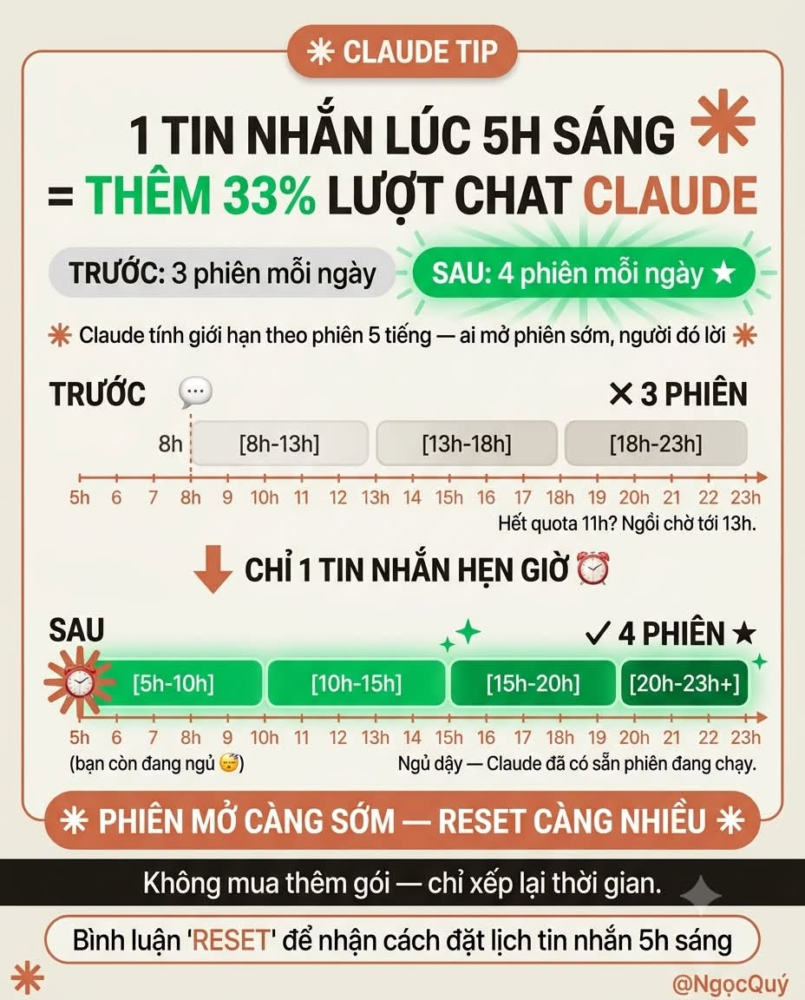
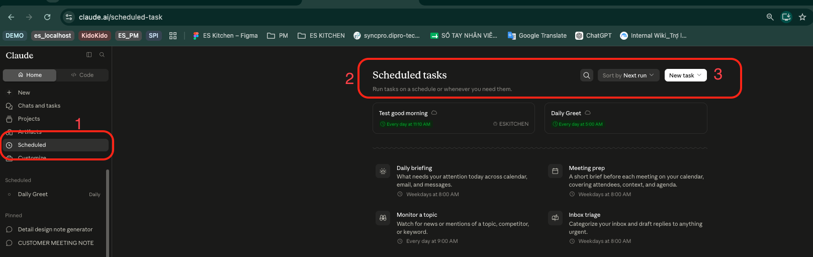
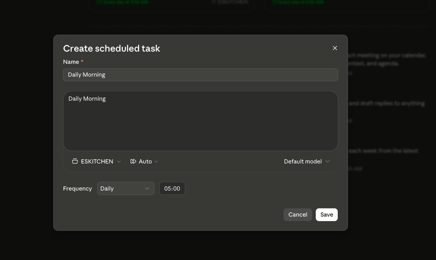

# Mẹo thiết lập phiên làm việc cho AI (Claude)

Một mẹo nhỏ để **tận dụng thêm thời gian sử dụng Claude** mà **không làm tăng quota**.

Trước đây, nếu bắt đầu làm việc từ 8:00 sáng, mỗi ngày chỉ dùng được khoảng **3 session** trước khi chạm giới hạn. Sau khi áp dụng cách dưới đây, có thể tận dụng lên **4 session/ngày**.

---

## Ý tưởng

Cơ chế session của Claude được reset theo mốc thời gian. Nếu **có một tin nhắn được gửi lúc ~5h sáng**, bạn sẽ mở thêm được một phiên (session) sớm, giúp phân bổ đủ 4 phiên trong ngày làm việc thay vì chỉ 3.

Cách làm: dùng **Scheduled Tasks** của Claude để tự động gửi 1 tin nhắn vào lúc 5:00 sáng mỗi ngày.

---

## Các bước thực hiện

### 1. Đăng nhập Claude và mở Scheduled Tasks

Truy cập: <https://claude.ai/scheduled-task>

Trên giao diện:
1. Mở mục **Scheduled** ở sidebar trái.
2. Kiểm tra danh sách **Scheduled tasks** ở khu vực chính.
3. Bấm **New task** ở góc trên bên phải → chọn **Set up manually**.

### 2. Điền thông tin cho task

| Trường | Giá trị gợi ý |
|---|---|
| **Name** | Đặt tên tùy ý, ví dụ `Daily Morning` |
| **Prompt** | Bất kỳ nội dung nào, ví dụ: `Chào buổi sáng các tình yêu nhé.` |
| **Project** | Chọn project mong muốn |
| **Mode** | `Automatically approve` |
| **Frequency** | `Daily` |
| **Time** | `05:00` |
| **Model** | Chọn **Haiku** để tiết kiệm quota |

Bấm **Save** để lưu task.

### 3. Kết quả

Từ **5:00 sáng mỗi ngày**, Claude sẽ tự tạo một history mới trong Scheduled Tasks. Nhờ vậy, khi bạn bắt đầu làm việc lúc 8:00, phiên đã được "kích hoạt" từ sớm và bạn có thêm 1 session sử dụng trong ngày.

---

## Lưu ý

> ⚠️ Đây chỉ là mẹo **tối ưu cách phân bổ thời gian sử dụng** theo cơ chế session của Claude, **không phải cách tăng quota** hay vượt giới hạn token.
>
> Hiệu quả có thể khác nhau tùy **gói dịch vụ** và cách Anthropic tính phiên làm việc tại từng thời điểm.

- Dùng model **Haiku** cho task tự động để giảm tiêu hao quota.
- Nội dung prompt không quan trọng — mục tiêu chỉ là "chạm" vào hệ thống để mở phiên mới.
- Có thể điều chỉnh giờ (ví dụ 04:30, 05:30) nếu lịch làm việc khác.
