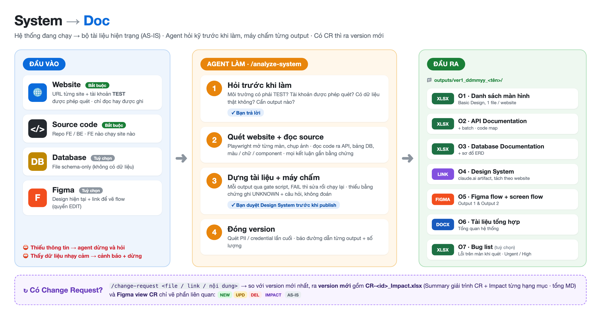
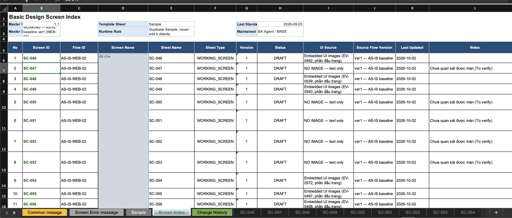
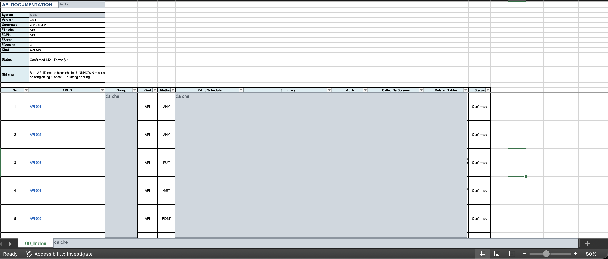
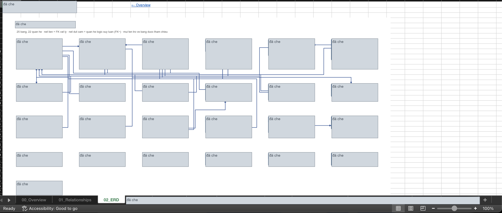
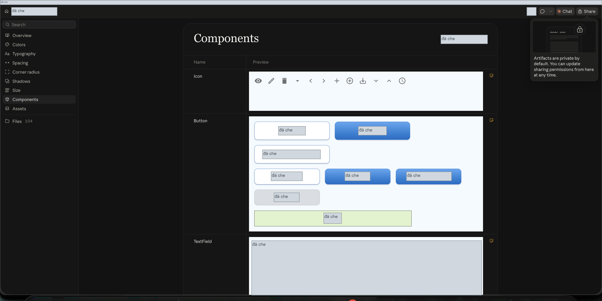
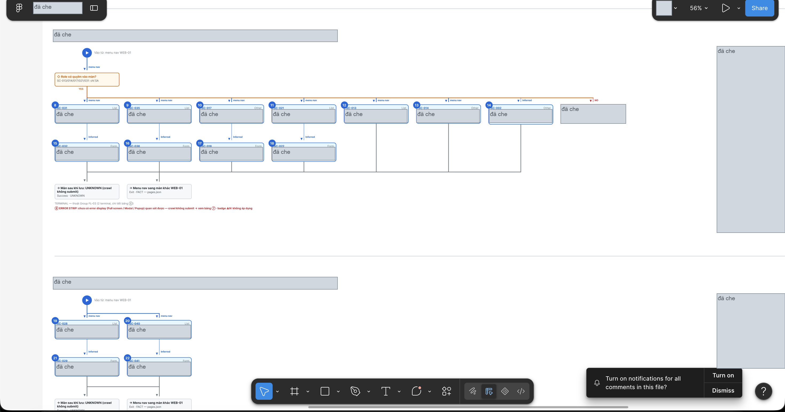
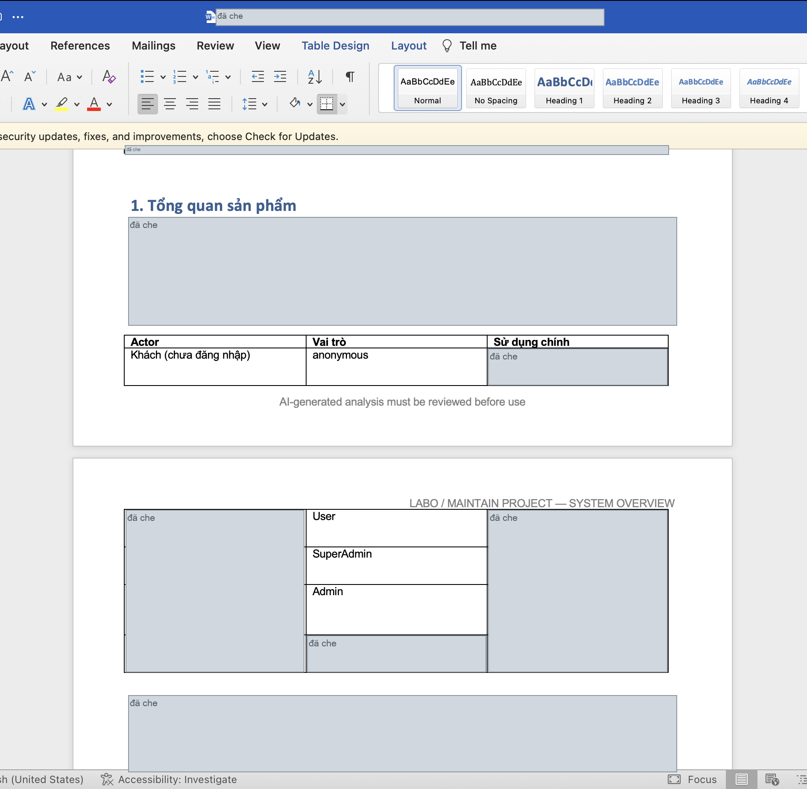
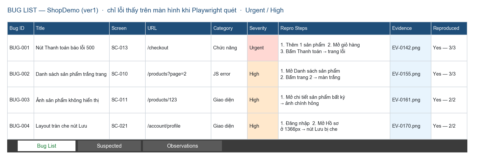
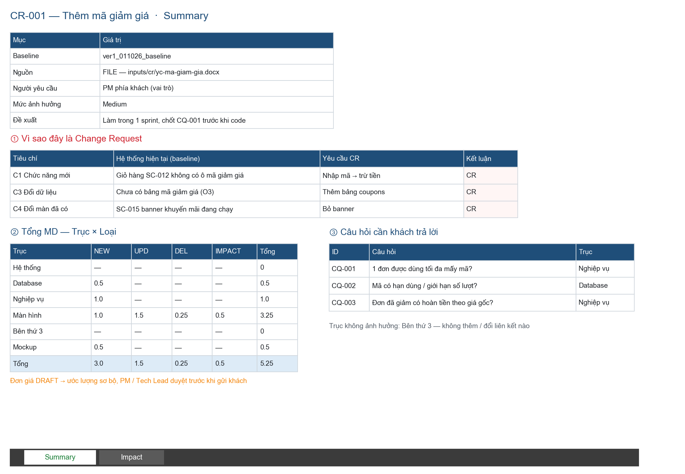
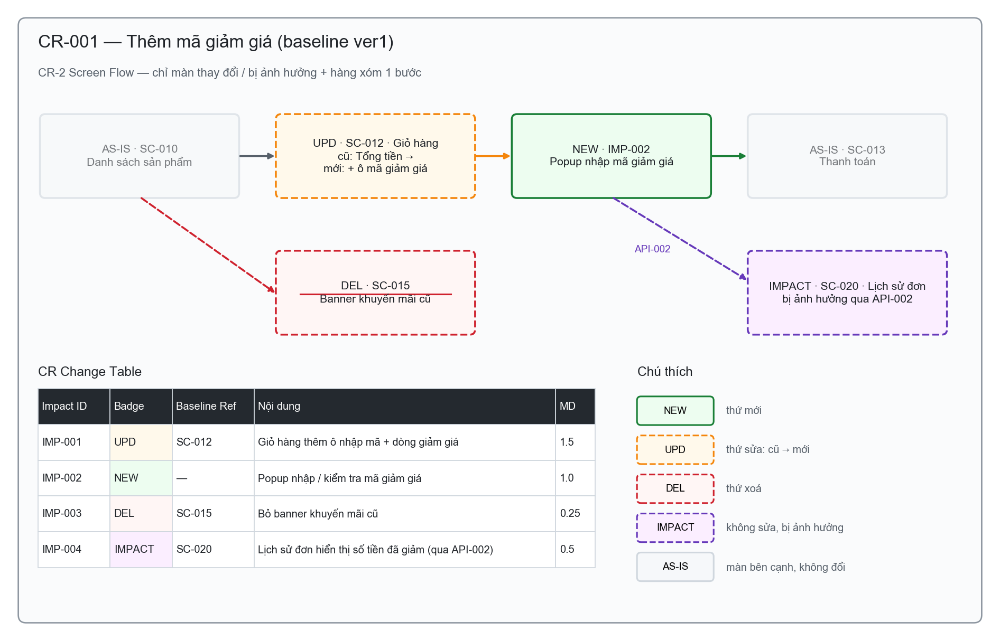

# BA AI Kit

Bộ công cụ AI hỗ trợ **Business Analyst**:
- **Dự án mới** — nhận input requirement dạng bất kỳ (docx / md / xlsx / pdf / meeting note / user chat), tự động tạo **SPEC.md + Figma flow + HTML prototype** để bàn giao stakeholder hoặc chuyển tiếp Tech Lead / Designer.
- **Hệ thống đã có sẵn** — khảo sát website · source code · DB · Figma để dựng **bộ tài liệu baseline có version**, rồi dùng baseline đó phân tích ảnh hưởng của từng **Change Request**.

## Danh sách tool

| # | Tool | Mục đích | Nền tảng | Hướng dẫn sử dụng |
|---|------|----------|----------|-------------------|
| 1 | [Requirement to Flow](./requirement-to-flow/) | Từ requirement bất kỳ → SPEC.md + 3 Figma frames (Flow / Screen Flow / Screens+Items) + HTML Prototype | Claude Code + Figma MCP | [README chi tiết](./requirement-to-flow/README.md) |
| 2 | [System to Doc](./system-to-doc/) | Từ hệ thống đang chạy (website · source · DB · Figma) → bộ tài liệu baseline 7 output (màn hình · API · DB · Design System · Figma flow · tổng hợp · bug list) + phân tích ảnh hưởng Change Request có MD | Claude Code + Playwright + Figma MCP | [README chi tiết](./system-to-doc/README.md) · [Hướng dẫn .docx](./system-to-doc/docs/) |

---
## Tool `requirement-to-flow` tạo ra **3 Figma frame + 1 HTML prototype + 1 SPEC.md** trong 1 lần chạy. Ảnh dưới đây là sample thật từ 1 feature (In-App VoIP Call).

### Output 1 — Flow Tổng Quan

Business Logic Flow (Actor → Trigger → Function → Technology → Outcome) + Sitemap WBS Tree + Technology Stack table. Dùng để stakeholder / Tech Lead nắm bức tranh tổng quan trong 1 nhìn.

---

### Output 2 — Screen Flow

Chia flow thành N group theo business logic, kèm bảng Index screens. Dùng để Designer nắm được trình tự màn hình + Tech Lead cắt task theo group.

---

### Output 3 — Screens + Items + Error Scenarios

Mockup từng screen kèm bảng ITEMS (component / behavior) + ERROR SCENARIOS (non-happy case). Dùng làm input cho Designer làm high-fi UI và QC viết test case.

---

## Tool `system-to-doc` có **2 luồng**: `/analyze-system` dựng baseline 7 output cho hệ thống có sẵn, `/change-request` đối chiếu baseline để phân tích ảnh hưởng 1 yêu cầu thay đổi. Mỗi lần chạy lưu thành 1 folder version `outputs/ver<N>_<DDMMYY>_<tên>/`, không sửa version cũ.

AI **chỉ đọc** (mọi thao tác ghi trên website bị chặn ở tầng mạng), **dừng khi gặp dữ liệu nhạy cảm**, và mọi dòng tài liệu đều gắn bằng chứng — không có bằng chứng thì ghi `UNKNOWN`, không viết đại. Ảnh dưới đây chụp từ lần chạy thật (đã che tên dự án).

### Luồng 1 — Baseline (`/analyze-system`)

| # | Output | Dùng để |
|---|---|---|
| **O1** | Danh sách màn hình theo website (template Basic Design công ty) | Nắm tổng số màn, item, xử lý, liên kết giữa các màn |
| **O2** | API Documentation (xlsx) + sơ đồ map code FE ↔ BE ↔ DB | Tech Lead tra cứu API, batch, chỗ code liên quan |
| **O3** | Database Documentation (xlsx) + ERD | Tra cứu bảng, field, quan hệ |
| **O4** | Design System hệ thống cũ — cùng chuẩn với `designer-kit` | Làm màn mới nhất quán với hệ thống cũ |
| **O5** | Figma flow — Flow tổng quan + Screen flow | Stakeholder nắm bức tranh tổng quan |
| **O6** | Tài liệu tổng hợp (docx) | Đã chạy gì, có gì, ở đâu, điểm còn chưa chắc |
| **O7** | Bug list hiện trạng — lỗi trên màn hình mức Urgent / High *(tuỳ chọn)* | Báo khách tình trạng hệ thống trước khi nhận |

#### O1 — Danh sách màn hình

#### O2 — API Documentation

#### O3 — Database Documentation

#### O4 — Design System

#### O5 — Figma flow

#### O6 — Tài liệu tổng hợp

#### O7 — Bug list

---

### Luồng 2 — Change Request (`/change-request`)

Đưa yêu cầu vào (file trong `inputs/cr/` · dán vào chat · link) → AI đối chiếu baseline mới nhất, **giải trình vì sao đây là CR**, phân tích ảnh hưởng theo 6 trục (Hệ thống · Database · Nghiệp vụ · Màn hình · Bên thứ 3 · Mockup):

- `CR-<id>_Impact.xlsx` — sheet `Summary` (giải trình CR · tổng MD · câu hỏi cho khách) + sheet `Impact` (từng hạng mục thêm / sửa / xoá / bị ảnh hưởng, vì sao phải sửa, rủi ro, MD). MD do script tính từ bảng đơn giá, AI không tự gõ số.
- Figma **view CR mới** — chỉ phần thay đổi + phần bị ảnh hưởng, tô màu theo loại, không vẽ đè bản cũ.

---
