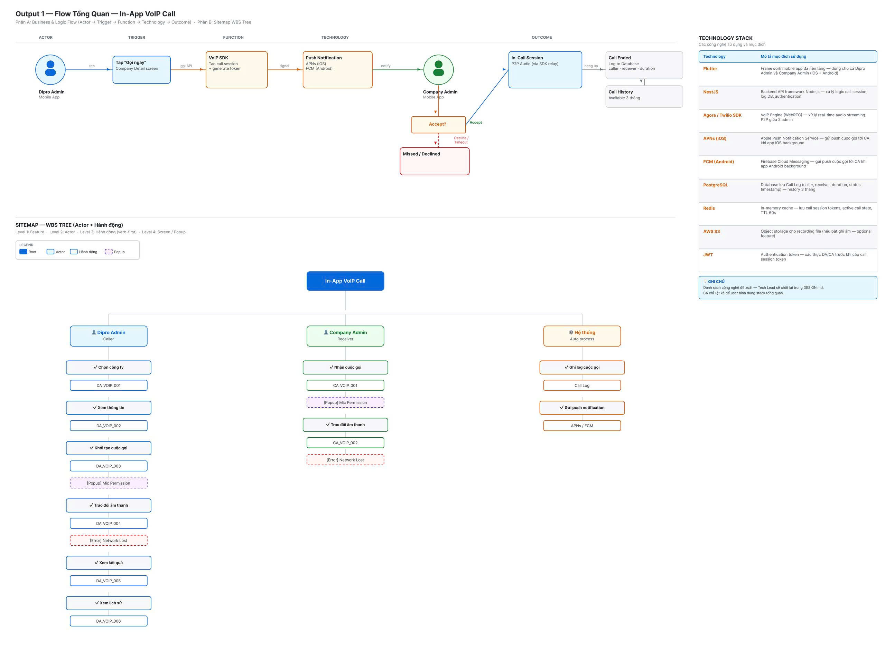
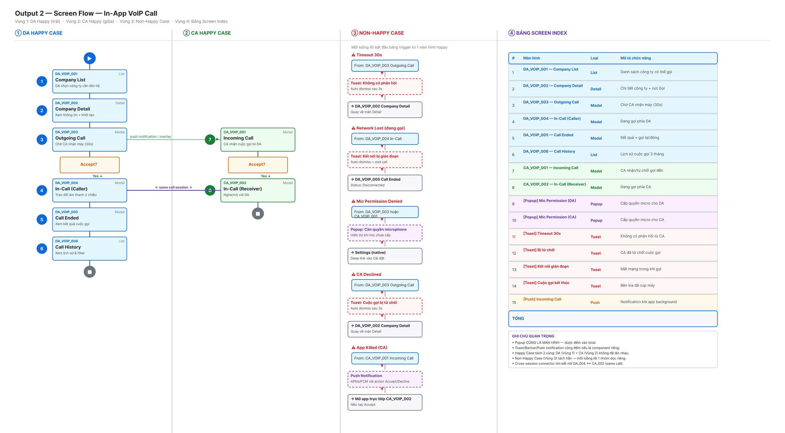
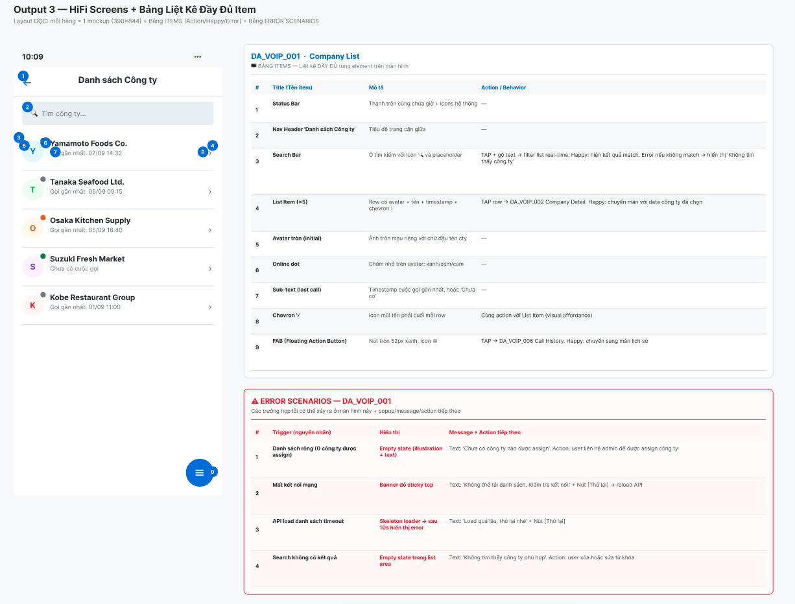

# requirement-to-flow — BA Kit Feature

> Nhận input **bất kỳ** (file estimation `.xlsx`, docs `.md`/`.docx`/`.pdf`, meeting note, user chat...) → BA agent tự phân tích → generate **SPEC.md** + **3 Figma frames** (Flow Tổng Quan / Screen Flow / Screens + Items) + **HTML Prototype**. Có versioning snapshot mỗi lần chạy để user feedback + so sánh lịch sử.

--- 
## Quy trình từ A → Z

### Bước 1 — Chuẩn bị thư mục dự án + input files

Tạo folder chứa dự án, đưa file input requirement vào:

```
my-project/
└── requirements/
    ├── feature_A.docx            ← file docs mô tả requirement
    ├── feature_B.md              ← hoặc markdown
    ├── estimation.xlsx           ← hoặc excel estimation
    ├── meeting_note_2026-09-11.md   ← hoặc note họp
    └── overview.pdf              ← hoặc PDF spec
```

> Input càng nhiều thông tin → BA output càng chính xác. Không có input file cũng OK — BA sẽ hỏi user trực tiếp qua chat.

---

### Bước 2 — Copy thư mục vào dự án

**Cách 1 — Copy manual:**

```bash
1- Mở folder requirement-to-flow bạn tải từ GitHub về
2- Copy toàn bộ thư mục 
3- Paste vào trong folder dự án bạn tạo
```

Sau khi copy:

```
my-project/
├── requirements/            ← file input của bạn
├── CLAUDE.md                ← bootstrap
├── POLICIES.md              ← AI behavior rules
├── AGENTS.md                ← mô tả BA agent (không cần sửa)
└── .claude/
    ├── agents/ba-agent.md
    ├── ba-agent/            ← support docs
    ├── skills/              ← business-analyst + ba-figma-output
    ├── context/             ← spec-template, versioning...
    ├── rules/               ← POLICY, RELIABILITY, SECURITY...
    └── commands/
        ├── create-spec.md
        └── create-feature.md
```

---

### Bước 3 — Chạy BA agent

Mở Claude Code tại folder dự án:

```bash
cd my-project
claude
```

**Trigger BA agent** (chọn 1 trong 3 cách):

**Cách A — Natural language:**

```
Hãy là BA, đọc file requirements/feature_A.docx và làm SPEC cho feature này
```

**Cách B — Slash command:**

```
/create-spec feature_A
```


**BA agent sẽ:**

1. **Hỏi user 3 câu preflight (BẮT BUỘC):**
   - Câu 0.4: Scope? (Chức năng đơn lẻ / Cụm chức năng / Toàn hệ thống)
   - Câu 0: Platform? (Mobile app / Web app / Website / iPad-Tablet)
   - Câu 0.5: Figma URL? (paste URL `figma.com/design/...`)

2. **Tạo 5 outputs (Definition of Done):**

| # | Output | Path / URL |
|---|---|---|
| 0 | `SPEC.md` (14 sections chuẩn) | `<DOCS_ROOT>/features/<feature>/SPEC.md` |
| 1 | Figma Frame — **Flow Tổng Quan** (Business Logic + Tech Table + Sitemap) | Node trên Figma Design page user chọn |
| 2 | Figma Frame — **Screen Flow** (N groups theo business flow + Bảng Index) | Node Figma |
| 3 | Figma Frame — **Screens + Items** (mockup + bảng ITEMS + ERROR SCENARIOS) | Node Figma |
| 4 | **HTML Prototype** (standalone, mở bằng `open index.html`) | `<DOCS_ROOT>/features/<feature>/prototype/index.html` |

3. **Snapshot vào `versions/v<N>_<DDMMYYYY>/`** — mỗi lần chạy tự lưu snapshot để user feedback + so sánh với version trước

---

### Bước 4 — Feedback + rerun

**Sau khi BA output xong, user có 2 lựa chọn:**

**Option A — OK, không sửa:**
- Kết thúc, dùng SPEC.md + Figma URL để bàn giao cho stakeholder / Tech Lead / Designer

**Option B — Cần sửa:**
- Ghi feedback vào `<DOCS_ROOT>/features/<feature>/versions/v<N>_<DDMMYYYY>/ba-outputs-log.md` section "Feedback"
- Trigger lại BA agent: `"Hãy là BA, review feedback trong versions/v1_11092026/ba-outputs-log.md và tạo v2"`
- BA sẽ đọc feedback → cập nhật SPEC + Figma → snapshot vào `v2_<DDMMYYYY>/`

---

## Bảng tổng hợp Outputs

| # | Output | Nội dung chính | Format / Nơi lưu |
|---|---|---|---|
| 1 | **Flow Tổng Quan** | Business Logic Flow (Actor → Trigger → Function → Technology → Outcome) + Sitemap WBS Tree + Technology Stack table | Figma Frame (node trên page user cung cấp) |
| 2 | **Screen Flow** | N vùng theo business logic (Happy per actor + Non-Happy tổng hợp) + Bảng Screen Index (screen code · loại · mô tả) | Figma Frame |
| 3 | **Screens + Items + Error Scenarios** | Mockup từng screen (390×844 hoặc theo platform) + Bảng ITEMS (element + behavior) + Bảng ERROR SCENARIOS | Figma Frame |
| 4 | **HTML Prototype** | File `index.html` standalone mô phỏng tương tác các màn hình chính | `<output>/prototype/index.html` |
| 5 | **SPEC.md** | 14 sections chuẩn (Overview / Actors / User Flow / Screens / Business Rules / AC / Ambiguities / ...) + link tới cả 3 Figma frames + HTML prototype | `<output>/SPEC.md` |
| 6 | **Snapshot version** | Copy toàn bộ 5 outputs trên vào folder version + `ba-outputs-log.md` (input + feedback) | `<output>/versions/v<N>_<DDMMYYYY>/` |


---

## Preview outputs mẫu

Sample thật từ feature **In-App VoIP Call**. Mỗi lần chạy BA agent sẽ tạo đủ bộ **3 Figma frames + 1 HTML prototype + 1 SPEC.md**.

### Output 1 — Flow Tổng Quan
**Nội dung:** Business Logic Flow (Actor → Trigger → Function → Technology → Outcome) + Sitemap WBS Tree (level 1-4: Feature → Actor → Hành động → Screen/Popup) + Technology Stack table.




---

### Output 2 — Screen Flow
**Nội dung:** Chia flow thành N vùng theo business logic (mỗi Actor Happy Case 1 vùng + 1 vùng Non-Happy Case tổng hợp) + Bảng Screen Index liệt kê tất cả màn hình (screen code · loại · mô tả chức năng).



---

### Output 3 — Screens + Items + Error Scenarios
**Nội dung:** Mỗi hàng = 1 mockup (390×844 hoặc theo platform user chọn) + Bảng ITEMS (từng element trên screen: title + mô tả + action/behavior) + Bảng ERROR SCENARIOS (mọi trường hợp lỗi có thể xảy ra + popup/message + action tiếp theo).



---

