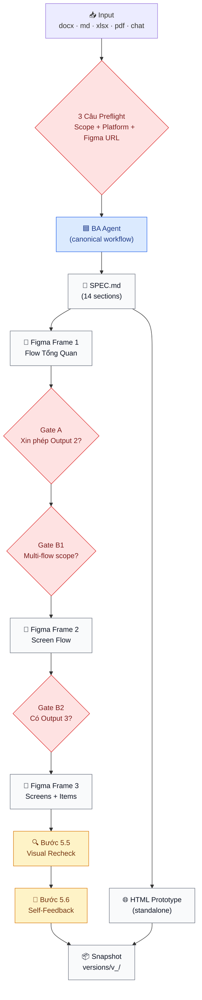

# requirement-to-flow — BA Kit Feature

> Nhận input **bất kỳ** (file estimation `.xlsx`, docs `.md`/`.docx`/`.pdf`, meeting note, user chat...) → BA agent tự phân tích → generate **SPEC.md** + **3 Figma frames** (Flow Tổng Quan / Screen Flow / Screens + Items) + **HTML Prototype**. Có versioning snapshot mỗi lần chạy để user feedback + so sánh lịch sử.

---

## Quy trình từ A → Z

### Bước 0 — Cài & đăng nhập Claude Code CLI

Kit này chạy trên **Claude Code CLI**.

**Yêu cầu:** Node.js ≥ 18 (khuyến nghị dùng `nvm`).

```bash
# Cài Claude Code CLI (global)
npm install -g @anthropic-ai/claude-code

# Kiểm tra
claude --version
```

**Đăng nhập lần đầu:**

```bash
claude    # chạy tại thư mục bất kỳ
```

---

### Bước 1 — Chuẩn bị thư mục dự án + input files

Tạo folder chứa dự án, đưa file input requirement vào:

```
my-project/
└── requirements/
    ├── feature_A.docx            ← file docs mô tả requirement
    ├── feature_B.md              ← hoặc markdown
    ├── estimation.xlsx           ← hoặc excel estimation
    ├── meeting_note_2026-09-11.md   ← hoặc note họp
    └── overview.pdf              ← hoặc PDF spec
```

> Input càng nhiều thông tin → BA output càng chính xác. Không có input file cũng OK — BA sẽ hỏi user trực tiếp qua chat.

---

### Bước 2 — Copy kit vào dự án

**Cách 1 — Copy manual:**

```bash
# Từ thư mục chứa ba-kit (đổi <path-to-ba-kit> cho đúng)
cp -r <path-to-ba-kit>/requirement-to-flow/.claude ./.claude
cp <path-to-ba-kit>/requirement-to-flow/CLAUDE.md ./
cp <path-to-ba-kit>/requirement-to-flow/POLICIES.md ./
cp <path-to-ba-kit>/requirement-to-flow/AGENTS.md ./
```

Sau khi copy:

```
my-project/
├── requirements/            ← file input của bạn
├── CLAUDE.md                ← bootstrap
├── POLICIES.md              ← AI behavior rules
├── AGENTS.md                ← project-specific (EDIT sau)
└── .claude/
    ├── agents/ba-agent.md
    ├── ba-agent/            ← support docs
    ├── skills/              ← business-analyst + ba-figma-output
    ├── context/             ← specification, doc-structure...
    ├── rules/               ← POLICY, RELIABILITY, SECURITY...
    └── commands/
        ├── create-spec.md
        └── create-feature.md
```

---

### Bước 3 — Setup context nghiệp vụ (BẮT BUỘC)

**Sửa 3 file để BA hiểu dự án của bạn:**

1. **`AGENTS.md`** — điền:
   - Tên dự án + mô tả domain nghiệp vụ 1-2 câu
   - Danh sách repo (nếu có source code): tên, đường dẫn, vai trò (backend/frontend/mobile), stack
   - Danh sách actor/persona: ai dùng hệ thống, dùng repo nào

2. **`.claude/context/specification.md`** — điền:
   - Domain nghiệp vụ chi tiết
   - Danh sách integration bên ngoài (payment gateway, SMS, email, push, LINE, Slack...)

3. **`.claude/context/doc-structure.md`** — điền:
   - `<DOCS_ROOT>` = path tới folder chứa SPEC/DESIGN/PLAN của bạn (ví dụ `docs/features/` hoặc `<project>-docs/docs/features/`)

> Không cần điền đủ ngay — điền tối thiểu ở lần đầu chạy, BA agent sẽ hỏi thêm nếu thiếu.

---

### Bước 4 — Chạy BA agent

Mở Claude Code tại folder dự án:

```bash
cd my-project
claude
```

**Trigger BA agent** (chọn 1 trong 3 cách):

**Cách A — Natural language:**

```
Hãy là BA, đọc file requirements/feature_A.docx và làm SPEC cho feature này
```

**Cách B — Slash command:**

```
/create-spec feature_A
```

**Cách C — Full pipeline (nếu cần build ngay sau):**

```
/create-feature feature_A
```

**BA agent sẽ:**

1. **Hỏi user 3 câu preflight (BẮT BUỘC):**
   - Câu 0.4: Scope? (Chức năng đơn lẻ / Cụm chức năng / Toàn hệ thống)
   - Câu 0: Platform? (Mobile app / Web app / Website / iPad-Tablet)
   - Câu 0.5: Figma URL? (paste URL `figma.com/design/...`)

2. **Đọc file input** (nếu có) — tự parse `.md`, `.docx`, `.xlsx`, `.pdf`, hoặc user paste text trực tiếp

3. **Tạo 5 outputs (Definition of Done):**

| # | Output | Path / URL |
|---|---|---|
| 0 | `SPEC.md` (14 sections chuẩn) | `<DOCS_ROOT>/features/<feature>/SPEC.md` |
| 1 | Figma Frame — **Flow Tổng Quan** (Business Logic + Tech Table + Sitemap) | Node trên Figma Design page user chọn |
| 2 | Figma Frame — **Screen Flow** (N groups theo business flow + Bảng Index) | Node Figma |
| 3 | Figma Frame — **Screens + Items** (mockup + bảng ITEMS + ERROR SCENARIOS) | Node Figma |
| 4 | **HTML Prototype** (standalone, mở bằng `open index.html`) | `<DOCS_ROOT>/features/<feature>/prototype/index.html` |

4. **Snapshot vào `versions/v<N>_<DDMMYYYY>/`** — mỗi lần chạy tự lưu snapshot để user feedback + so sánh với version trước

---

### Bước 5 — Feedback + rerun

**Sau khi BA output xong, user có 2 lựa chọn:**

**Option A — OK, không sửa:**
- Kết thúc, dùng SPEC.md + Figma URL để bàn giao cho stakeholder / Tech Lead / Designer

**Option B — Cần sửa:**
- Ghi feedback vào `<DOCS_ROOT>/features/<feature>/versions/v<N>_<DDMMYYYY>/ba-outputs-log.md` section "Feedback"
- Trigger lại BA agent: `"Hãy là BA, review feedback trong versions/v1_11092026/ba-outputs-log.md và tạo v2"`
- BA sẽ đọc feedback → cập nhật SPEC + Figma → snapshot vào `v2_<DDMMYYYY>/`

---

## Sơ đồ pipeline BA-only



---

## Ràng buộc quan trọng

- BA chỉ tạo/sửa file `.md` — **tuyệt đối không sửa source code**
- BA không thiết kế kỹ thuật (DB schema, API contract) — đó là việc Tech Lead
- Multi-flow feature (Scope `[B]` / `[C]`) → BA hỏi Gate B1/B2 để user chọn vẽ toàn bộ hay 1 flow
- Nếu user "có" Figma URL mà chưa paste → BA DỪNG chờ, KHÔNG tự skip
- Mọi lần chạy đều snapshot vào `versions/` — không overwrite version cũ

---

## Files quan trọng

| File | Vai trò |
|---|---|
| `.claude/agents/ba-agent.md` | Canonical BA workflow — sửa quy trình BA chỉ sửa file này |
| `.claude/ba-agent/spec-template.md` | Template 14 sections cho SPEC.md |
| `.claude/ba-agent/preflight-questions.md` | 3 câu Preflight + 10 câu chuẩn |
| `.claude/ba-agent/clarify-ambiguity.md` | Template hỏi khi request mơ hồ (≥2 diễn giải) |
| `.claude/ba-agent/versioning.md` | Rule snapshot vào `versions/v<N>_<DDMMYYYY>/` |
| `.claude/ba-agent/figma-outputs/*` | Chi tiết từng Figma output + gate rules |
| `.claude/ba-agent/templates/website_template.jpg` | 6-region layout cho HTML prototype website |

---

## Troubleshooting

| Vấn đề | Nguyên nhân | Fix |
|---|---|---|
| BA tự đoán platform / scope thay vì hỏi | User không trả lời Câu 0/0.4 rõ ràng | Trả lời 1 trong 3-4 option BA đưa ra, không nói mơ hồ |
| Figma output bị skip mặc dù user muốn có | User đã nói "có" Figma nhưng chưa paste URL | Paste URL đầy đủ `figma.com/design/...?node-id=...` — BA đang chờ |
| Output 3 vẽ ít hơn số screens Output 2 | Multi-flow feature, user chưa confirm Gate B2 scope | Trả lời Gate B2 (`[A]` toàn bộ / `[B]` 1 flow / `[C]` batch) |
| Không có `versions/` folder sau khi BA xong | BA skip snapshot | Yêu cầu BA re-run snapshot: "chạy lại snapshot cho version hiện tại" |

---

## Tham khảo

- Full BMAD pipeline (BA + TL + PM + Dev + QC + QA + Designer): [`../../project-ai-kit/`](../../project-ai-kit/)
- BA-only detail workflow: [`.claude/agents/ba-agent.md`](./.claude/agents/ba-agent.md)
