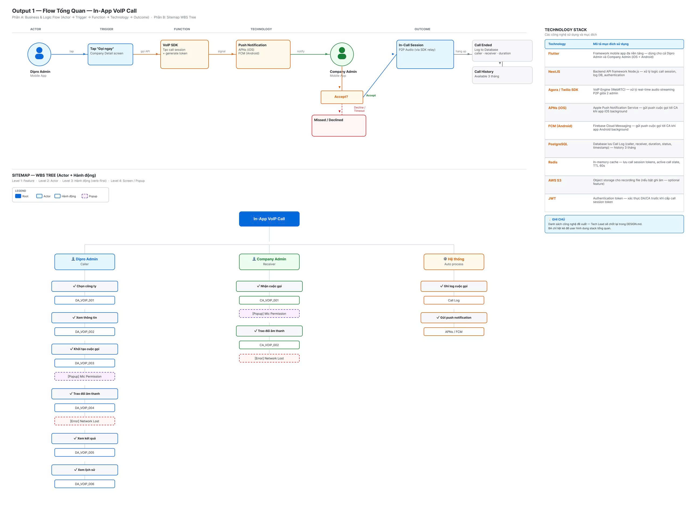
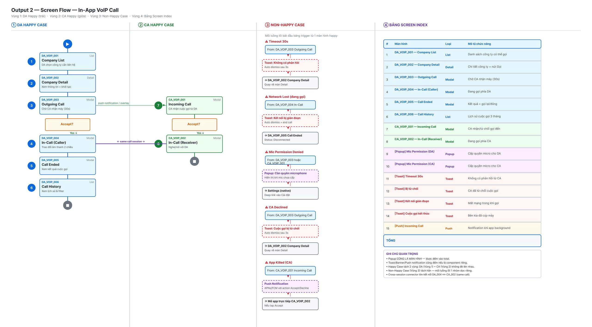
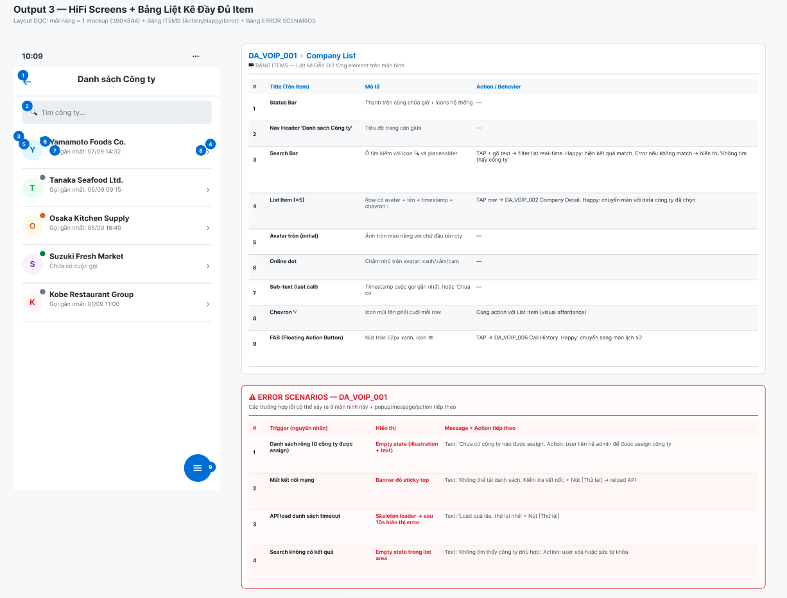

# requirement-to-flow — BA Kit Feature

> Nhận input **bất kỳ** (file estimation `.xlsx`, docs `.md`/`.docx`/`.pdf`, meeting note, user chat...) → BA agent tự phân tích → generate **SPEC.md** + **3 Figma frames** (Flow Tổng Quan / Screen Flow / Screens + Items) + **HTML Prototype**. Có versioning snapshot mỗi lần chạy để user feedback + so sánh lịch sử.

--- 
## Quy trình từ A → Z

### Bước 1 — Chuẩn bị thư mục dự án + input files

Tạo folder chứa dự án, đưa file input requirement vào:

```
my-project/
└── requirements/
    ├── feature_A.docx            ← file docs mô tả requirement
    ├── feature_B.md              ← hoặc markdown
    ├── estimation.xlsx           ← hoặc excel estimation
    ├── meeting_note_2026-09-11.md   ← hoặc note họp
    └── overview.pdf              ← hoặc PDF spec
```

> Input càng nhiều thông tin → BA output càng chính xác. Không có input file cũng OK — BA sẽ hỏi user trực tiếp qua chat.

---

### Bước 2 — Copy thư mục vào dự án

**Cách 1 — Copy manual:**

```bash
1- Mở folder requirement-to-flow bạn tải từ GitHub về
2- Copy toàn bộ thư mục 
3- Paste vào trong folder dự án bạn tạo
```

Sau khi copy:

```
my-project/
├── requirements/            ← file input của bạn
├── CLAUDE.md                ← bootstrap
├── POLICIES.md              ← AI behavior rules
├── AGENTS.md                ← mô tả BA agent (không cần sửa)
└── .claude/
    ├── agents/ba-agent.md
    ├── ba-agent/            ← support docs
    ├── skills/              ← business-analyst + ba-figma-output
    ├── rules/               ← DATA-PRIVACY, POLICY, RELIABILITY, SECURITY
    ├── hooks/               ← detect-pii.js (H06) + selftest
    ├── config/              ← pii-patterns.json
    ├── settings.json        ← nối hook vào PreToolUse
    └── commands/create-spec.md
```

---

### Bước 3 — Chạy BA agent

Mở Claude Code tại folder dự án:

```bash
cd my-project
claude
```

**Trigger BA agent** (chọn 1 trong 3 cách):

**Cách A — Natural language:**

```
Hãy là BA, đọc file requirements/feature_A.docx và làm SPEC cho feature này
```

**Cách B — Slash command:**

```
/create-spec feature_A
```


**BA agent sẽ:**

1. **Hỏi user 3 câu preflight (BẮT BUỘC):**
   - Câu 0.4: Scope? (Chức năng đơn lẻ / Cụm chức năng / Toàn hệ thống)
   - Câu 0: Platform? (Mobile app / Web app / Website / iPad-Tablet)
   - Câu 0.5: Figma URL? (paste URL `figma.com/design/...`)

2. **Tạo 5 outputs (Definition of Done) — Output 5 là on-demand:**

| # | Output | Path / URL |
|---|---|---|
| 0 | `SPEC.md` (14 sections chuẩn) | `<output-folder>/SPEC.md` |
| 1 | Figma Frame — **Flow Tổng Quan** (Business Logic + Tech Table + Sitemap) | Node trên Figma Design page user chọn |
| 2 | Figma Frame — **Screen Flow** (N groups theo business flow + Bảng Index) | Node Figma |
| 3 | Figma Frame — **Screens + Items** (mockup + bảng ITEMS + ERROR SCENARIOS) | Node Figma |
| 4 | **HTML Prototype** (standalone, mở bằng `open index.html`) | `<output-folder>/prototype/index.html` |
| 5 | **Basic Design** — ghi spec vào master Excel ⬜ **ON-DEMAND, BA sẽ hỏi trước** | master workbook do bạn chỉ định |
| OQ | **Open Questions** — các business rule BA chưa có câu trả lời 🔶 *chỉ khi còn câu chưa chốt* | `<output-folder>/open-questions/` (`OQ-REGISTER.md` + `open_questions.xlsx`) + Figma OQ view khi ≤ 20 câu |

3. **Snapshot vào `versions/v<N>_<DDMMYYYY>/`** — mỗi lần chạy tự lưu snapshot để user feedback + so sánh với version trước

---

### Bước 3.5 — Trả lời Open Question (nếu có)

Ngay trong lúc vẽ **Output 1 — Flow Tổng Quan**, sau khi BA đã hỏi bạn một lượt, những business rule vẫn chưa có câu trả lời sẽ được BA gom lại thành **Output OQ**:

- `<output-folder>/open-questions/open_questions.xlsx` — file để bạn điền (sheet `Guideline` hướng dẫn cách trả lời)
- **Figma OQ view** — card từng câu hỏi có ô `Trả lời:` để comment trực tiếp (chỉ tạo khi **≤ 20 câu**)
- **> 20 câu** → BA **chỉ** giao xlsx + in đường dẫn folder, không vẽ view (20+ card trên Figma không ai đọc hết)

**Cách trả lời (4 dạng, chọn 1 cho mỗi câu):**

| Dạng | Cách ghi vào cột `Câu trả lời của bạn` |
|---|---|
| ✅ OK theo đề xuất | `OK theo đề xuất` — đồng ý phương án BA gợi ý ở cột bên cạnh |
| ✏️ Sửa lại | Ghi **rule đúng, có số/điều kiện**. VD: `Hết 15 phút không thanh toán thì huỷ đơn` |
| ❓ Chưa biết | Ghi **ai trả lời + khi nào**. VD: `Chờ kế toán xác nhận, trả lời trước 05/10` |
| 🚫 Không áp dụng | Ghi lý do ngắn. VD: `Nghiệp vụ này đã bỏ từ tháng 8` |

- Ưu tiên trả lời câu `Blocker` trước — chúng đang chặn BA vẽ Output 2/3.
- Chỉ điền 4 cột bên phải (`Câu trả lời` · `Người trả lời` · `Ngày` · `Trạng thái`); đừng sửa/xoá các cột BA dùng để trace.
- 1 ô = 1 câu; tránh trả lời `tuỳ`, `linh động`, `như hiện tại` mà không chỉ rõ hệ thống/màn nào.
- Không điền dữ liệu thật của khách hàng (tên/SĐT/email/dữ liệu production) — dùng dữ liệu mẫu.
- Không muốn mở Excel → trả lời ngay trong chat theo format `OQ-03: <câu trả lời>` (mỗi câu 1 dòng).

Câu **không được trả lời** sẽ nằm ở `SPEC.md ## Open Questions` — BA **không tự suy diễn** thay bạn, và downstream (Tech Lead / Designer / QC) cũng không được tự giả định.

---

### Bước 4 — Feedback / Meeting note + rerun

**Sau khi BA output xong, user có 2 lựa chọn:**

**Option A — OK, không sửa:**
- Kết thúc, dùng SPEC.md + Figma URL để bàn giao cho stakeholder / Tech Lead / Designer

**Option B — Có feedback / vừa họp với KH:**
- Ghi feedback vào `<output-folder>/versions/v<N>_<DDMMYYYY>/ba-outputs-log.md` section "Feedback", hoặc để meeting note vào `<output-folder>/meetings/`
- Trigger lại BA agent: `"Hãy là BA, review feedback trong versions/v1_11092026/ba-outputs-log.md và tạo v2"` (hoặc `"vừa họp với KH, xử lý meeting note này"`)

**BA sẽ phân định từng item trước khi sửa (không sửa ngay):**

| Nhãn | Là gì | BA làm gì |
|---|---|---|
| 🔴 **CR** (ChangeRequest) | Ngoài scope đã chốt — thêm/bỏ màn hình, đảo quyết định đã approve, nằm trong `## Out of Scope`, ảnh hưởng effort/schedule | ① in giải trình **vì sao đây là CR** kèm trích dẫn baseline → ② hỏi lại bạn (`AskUserQuestion`) → ③ vẽ **CR view MỚI** (không vẽ chồng Output 1/2/3), mỗi node có badge 🟩 NEW / 🟨 UPD / 🟥 DEL / ⬜ AS-IS + bảng CR Change Table → ④ tạo `output_cr.md` (tài liệu trao đổi KH, ≤ 1 trang, gạch đầu dòng + reference file) → ⑤ snapshot `v<N+1>` |
| 🟡 **FEEDBACK** | Trong scope — BA vẽ sai/thiếu, chốt Open Question, wording/layout, chi tiết hóa item đã có | ① bảng Impact Analysis → ② hỏi lại bạn scope update (`AskUserQuestion`) → ③ scoped update (không regenerate toàn bộ) → ④ snapshot `v<N+1>` |
| ⚪ **CHƯA RÕ** | Không trích được bằng chứng từ baseline | Hỏi bạn, không tự chọn nhánh |

- 1 meeting note thường có **cả hai loại** → BA phân loại từng item, không gán 1 nhãn cho cả note.
- Cả 2 nhánh đều lưu kết quả vào **version mới** `v<N+1>_<DDMMYYYY>/` — `v<N>` giữ nguyên làm baseline đối chiếu.
- CR chưa được KH chốt → BA **không** ghi vào Happy Path / AC, chỉ ghi `CR-<ID>: chờ KH xác nhận` ở `## Ambiguities`.

---

## Bảng tổng hợp Outputs

| # | Output | Nội dung chính | Format / Nơi lưu |
|---|---|---|---|
| 1 | **Flow Tổng Quan** | Business Logic Flow (Actor → Trigger → Function → Technology → Outcome) + Sitemap WBS Tree + Technology Stack table | Figma Frame (node trên page user cung cấp) |
| 2 | **Screen Flow** | Flow hợp nhất phân nhánh (Happy + NG inline + System + Edge/Exceptional Panel riêng) + Bảng Screen Index (screen code · loại · mô tả) | Figma Frame |
| 3 | **Screens + Items + Error Scenarios** | Mockup từng screen (390×844 hoặc theo platform) + Bảng ITEMS (element + behavior) + Bảng ERROR SCENARIOS | Figma Frame |
| 4 | **HTML Prototype** | File `index.html` standalone mô phỏng tương tác các màn hình chính | `<output>/prototype/index.html` |
| 5 | **SPEC.md** | 14 sections chuẩn (Overview / Actors / User Flow / Screens / Business Rules / AC / Ambiguities / ...) + link tới cả 3 Figma frames + HTML prototype | `<output>/SPEC.md` |
| 6 | **Basic Design** ⬜ *on-demand* | Ghi specification vào **master Excel Basic Design** của công ty — duplicate sheet `Sample` cho từng screen, điền metadata + bảng item, cập nhật `Screen Error message` / `Common mesage` / `Screen Index` / `Change History` | Master workbook (mẫu: [`sample/sample_basic_design.xlsx`](./sample/sample_basic_design.xlsx)) |
| 7 | **Snapshot version** | Copy toàn bộ outputs trên vào folder version + `ba-outputs-log.md` (input + feedback) | `<output>/versions/v<N>_<DDMMYYYY>/` |
| 8 | **Open Questions** 🔶 *chỉ khi sau khi BA hỏi vẫn còn business rule chưa chốt* | Register `OQ-REGISTER.md` + **`open_questions.xlsx`** (3 sheet: `Guideline` hướng dẫn trả lời · `Open Questions` để bạn điền · `Summary`) + **Figma OQ view** khi ≤ 20 câu (> 20 câu → chỉ xlsx) | `<output>/open-questions/` + Figma node |
| 9 | **CR view + `output_cr.md`** 🔴 *chỉ khi feedback được phân loại là ChangeRequest* | Figma view RIÊNG cho CR (badge NEW / UPD / DEL / AS-IS + CR Change Table) + tài liệu trao đổi KH "vì sao đây là CR" (ngắn gọn, gạch đầu dòng, reference file) | Figma node mới + `<output>/versions/v<N+1>_<DDMMYYYY>/output_cr.md` |


---

## Preview outputs mẫu

Sample thật từ feature **In-App VoIP Call**. Mỗi lần chạy BA agent sẽ tạo đủ bộ **3 Figma frames + 1 HTML prototype + 1 SPEC.md**.

### Output 1 — Flow Tổng Quan
**Nội dung:** Business Logic Flow (Actor → Trigger → Function → Technology → Outcome) + Sitemap WBS Tree (level 1-4: Feature → Actor → Hành động → Screen/Popup) + Technology Stack table.




---

### Output 2 — Screen Flow
**Nội dung:** Toàn bộ quá trình vẽ trong 1 sơ đồ hợp nhất — không tách cột Non-Happy. NG (lỗi đã rõ) vẽ ngay tại điểm phát sinh; case chưa rõ (Edge/Exceptional) tách panel riêng bên cạnh kèm phân tích cho BRSE. Nếu nhiều business flow dùng chung 1 cụm màn hình (VD Auth) → gộp thành 1 group, fan-out về đúng luồng gốc ở cuối. Kèm Bảng Screen Index liệt kê tất cả màn hình (screen code · loại · mô tả chức năng).



---

### Output 3 — Screens + Items + Error Scenarios
**Nội dung:** Mỗi hàng = 1 mockup (390×844 hoặc theo platform user chọn) + Bảng ITEMS (từng element trên screen: title + mô tả + action/behavior) + Bảng ERROR SCENARIOS (mọi trường hợp lỗi có thể xảy ra + popup/message + action tiếp theo).



---

