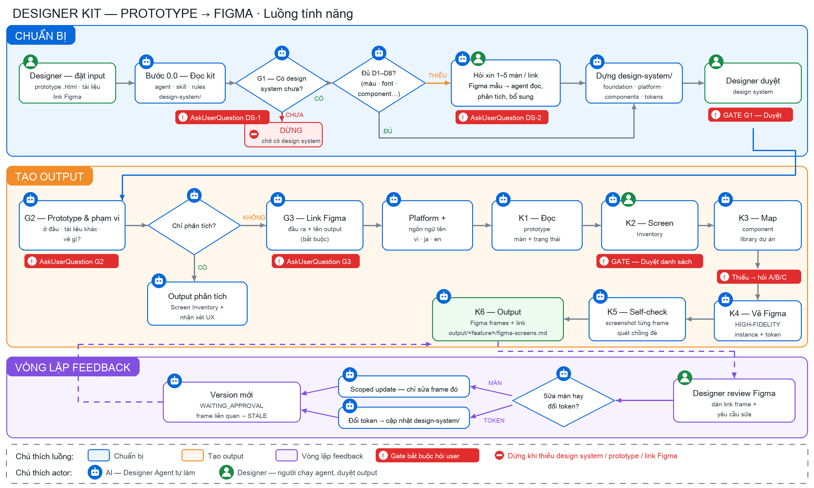

# prototype-to-figma — Designer Kit Feature

Chuyển **HTML Prototype** thành **Figma high-fidelity** đúng **design system của dự án bạn**. Dùng được cho mọi dự án.



## 1. Kết nối Figma MCP (làm 1 lần)

Chọn **1** trong 2 cách:

- **A — Connector claude.ai (khuyến nghị):** claude.ai → *Settings → Connectors* → bật **Figma** → đăng nhập Figma. Mở Claude Code bằng cùng tài khoản là dùng được.
- **B — `.mcp.json` có sẵn trong kit:** mở Claude Code tại folder này → gõ `/mcp` → chọn **figma** → **Authenticate** → Allow trên trình duyệt.

Kiểm tra: gõ `/mcp` → thấy **figma** ở trạng thái connected. Tài khoản Figma cần quyền **EDIT** file đầu ra.

## 2. Chuẩn bị

| Cần có | Ghi chú |
|---|---|
| **Design system** của dự án | Link Figma (Foundations / Component Library) · tài liệu guideline · hoặc 1–5 màn Figma đã duyệt. **Chưa có → agent dừng.** |
| **Prototype** `.html` | Copy vào `input/` |
| **Link Figma đầu ra** | File / page / section bạn có quyền EDIT |

## 3. Sử dụng

1. Mở Claude Code tại folder `prototype-to-figma`.
2. Dán prompt:
   ```
   Hãy là Designer, chuyển prototype trong folder input sang Figma
   ```
   hoặc gõ `/prototype-to-figma`
3. Trả lời các hộp chọn — thiếu gì agent hỏi, không tự đoán:
   - **Design system:** có chưa? đủ chưa? → thiếu thì gửi 1–5 màn / link Figma để agent tự phân tích, bổ sung
   - **Prototype & phạm vi:** vẽ toàn bộ · chọn màn · chỉ phân tích · 1 luồng
   - **Link Figma đầu ra** · tên output
   - **Platform** · **ngôn ngữ tên** màn (đề xuất vi + ja + en)
4. Duyệt design system (lần đầu) và danh sách màn → agent vẽ Figma.
5. Kết quả: frame trong Figma + `output/<feature>/figma-screens.md`.

## Lưu ý

- Màu, font, component lấy từ `design-system/` — không copy CSS của prototype.
- Tên đa ngôn ngữ được xuống dòng, không bị cắt chữ.
- Không đưa dữ liệu cá nhân thật vào Figma (hook H06 chặn khi phát hiện).
- Agent không sửa prototype, không commit / push.

📘 Hướng dẫn chi tiết có hình: `docs/Hướng dẫn sử dụng Prototype to Figma.docx`
