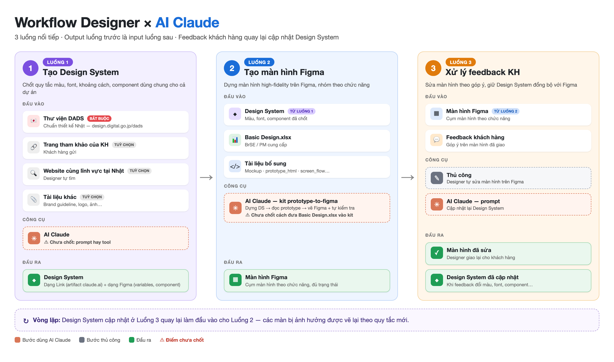

# Workflow Designer — Triển khai thiết kế với AI

Designer làm việc qua **3 luồng nối tiếp**. Output của luồng trước là input của luồng sau.

```
Luồng 1: Design System  ──►  Luồng 2: Màn hình Figma  ──►  Luồng 3: Feedback khách hàng
        ▲                                                            │
        └──────────── cập nhật lại Design System ◄───────────────────┘
```



---

## Luồng 1 — Tạo Design System cho dự án

**Mục tiêu:** Chốt bộ quy tắc thiết kế (màu, font, khoảng cách, component) dùng chung cho mọi màn hình của dự án.

### Đầu vào

| # | Nguồn | Mức độ | Ai cung cấp |
|---|---|---|---|
| 1 | Thư viện thiết kế chuẩn của Nhật — [DADS](https://design.digital.go.jp/dads/) | **Bắt buộc** | Có sẵn |
| 2 | Trang tham khảo do khách hàng gửi | Không bắt buộc | Khách hàng |
| 3 | Website cùng lĩnh vực tại Nhật | Không bắt buộc | Designer tự tìm |
| 4 | Tài liệu khác (brand guideline, logo, ảnh…) | Không bắt buộc | Khách hàng / PM |

### Đầu ra

**File Design System** — quy tắc các component trong thiết kế, gồm 2 dạng:

- **Link** (artifact trên claude.ai)
- **Figma** (variables, styles, component library)

### Công cụ

- **AI Claude** — ⚠️ *Chưa chốt hình thức: dùng prompt hay đóng gói thành tool.*

---

## Luồng 2 — Tạo màn hình Figma cho dự án

**Mục tiêu:** Dựng các màn hình high-fidelity trên Figma, nhóm theo chức năng.

### Đầu vào

| # | Nguồn | Ai cung cấp |
|---|---|---|
| 1 | File Design System | Output của Luồng 1 |
| 2 | File `Basic Design.xlsx` | BrSE / PM |
| 3 | Tài liệu bổ sung: mockup, `prototype_html`, `screen_flow`… | BA / BrSE |

### Đầu ra

- **Figma** — cụm màn hình nhóm theo chức năng.

### Công cụ

- **AI Claude** — dùng kit [`prototype-to-figma`](prototype-to-figma/) (chi tiết luồng xem [flow-prototype-to-figma.png](prototype-to-figma/docs/images/flow-prototype-to-figma.png)).
  ⚠️ *Chưa chốt cách đưa `Basic Design.xlsx` vào kit.*

---

## Luồng 3 — Xử lý feedback của khách hàng

**Mục tiêu:** Sửa màn hình theo góp ý và giữ Design System luôn đồng bộ với Figma.

### Đầu vào

- **Figma** — cụm màn hình theo chức năng (output của Luồng 2).
- **Feedback** của khách hàng.

### Đầu ra

1. Màn hình Figma đã sửa — Designer giao lại cho khách hàng.
2. Design System đã cập nhật (nếu feedback làm thay đổi màu, font, component…).

### Công cụ

| Việc | Cách làm |
|---|---|
| Sửa màn hình Figma | **Thủ công** (Designer sửa tay) |
| Cập nhật Design System | **AI Claude** — dùng prompt |
