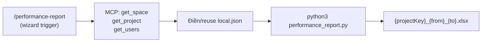

# Kit 7: pm-ai-kit

> **Project Management Assistant** — Wizard tự động hoá báo cáo hiệu suất thành viên từ Backlog API.

---

## Mục đích

`pm-ai-kit` hỗ trợ PM chạy báo cáo định kỳ mà không phải tổng hợp tay:

- Kết nối Backlog qua MCP để auto-detect space/project
- Wizard hỏi API key, allocation, khoảng thời gian — cache lại vào `local.json`
- Sinh file Excel 5–6 sheet với chú thích ngưỡng màu sẵn sàng gửi stakeholder

---

## Pipeline



Wizard **stateless** — mỗi session độc lập, đọc lại config từ `local.json` (không nhớ session trước).

---

## Commands chi tiết

### `/performance-report`

**Input:** wizard hỏi tương tác (API key, project, members, allocation, khoảng thời gian)
**Output:** `performance-report/{projectKey}_{YYYYMMDD}_{YYYYMMDD}.xlsx`

```bash
/performance-report
```

Nếu đã có `local.json` hợp lệ → wizard cho **reuse / edit / reset**. Lần đầu → copy từ `local.json.example` và điền theo hướng dẫn.

!!! warning "Bảo mật"
    API key chỉ hiển thị `***` trên chat. `local.json`, `data/*.json`, `*.xlsx` đều đã `.gitignore`.

---

## Sheets trong Excel output

| Sheet | Nội dung |
|---|---|
| **Dashboard** | Bảng tuần: Total/Done/Remain Task, Total/Done/Remain Bug, Estimate/Actual, Productivity, Effort Load |
| **Monthly_Stats** | Bảng tháng: cùng cột Dashboard + `Bug_Rate (%)` |
| **Member_Availability** | Số giờ tải/ngày (Mon–Fri) từng member |
| **Action_Required** | Backlog issues cần PM sửa (thiếu Estimate / Start / Due) |
| **Backlog_Watch** | Issues chưa done / overdue (tuỳ chọn khi wizard hỏi) |
| **Raw_Data** | Toàn bộ dữ liệu thô để verify |

Mỗi sheet có bảng **Chú thích** đi kèm giải thích ngưỡng màu.

---

## Tiêu chí đánh giá

### Productivity (%)

```
Productivity = Total Estimate Hours / Total Actual Hours × 100
```

| Productivity | Ý nghĩa |
|---|---|
| **> 100%** | 🟢 Hoàn thành nhanh hơn estimate |
| **80% – 100%** | 🟡 Làm đúng effort dự kiến |
| **< 80%** | 🔴 Tốn nhiều effort hơn estimate — cần review |

### Effort Load (Dashboard — theo tuần)

So sánh **tổng Estimate Hours** vs **Allocation Hours** (chuẩn 100% allocation = **40h/tuần**).

| Ratio (Estimate ÷ Alloc-hours) | Nhãn |
|---|---|
| **< 87.5%** (< 35h) | 🟡 Còn dư — có thể assign thêm |
| **87.5% – 100%** (35–40h) | 🟢 Đủ |
| **> 100%** (> 40h) | 🔴 Quá tải — cần chia bớt |

### Bug_Rate (Monthly_Stats)

```
Bug_Rate (%) = Total Bug / Total Estimate Hours × 100
```

| Bug_Rate | Ý nghĩa |
|---|---|
| **< 10%** | 🟢 Chất lượng tốt |
| **≥ 10%** | 🔴 Nhiều bug so với effort — cần review chất lượng |

### Task / Bug (theo tuần & tháng)

| Cột | Nguồn |
|---|---|
| Total Task | Σ issues có `dueDate` trong kỳ (bao gồm bug) |
| Task Done | Task có status ∈ {Resolved, Closed, Done, 完了, 解決済み, 処理済み} |
| Task Remain | Total − Done |
| Total Bug | Subset của Task, `issueType == "Bug"` |
| Bug Done / Remain | Tương tự Task |

---

## Cấu trúc kit

```
pm-ai-kit/
├── README.md
├── POLICIES.md
├── AGENTS.md
├── CLAUDE.md
├── .claude/
│   ├── agents/
│   │   └── performance-report-agent.md
│   ├── commands/
│   │   └── performance-report.md
│   └── settings.json
└── performance-report/
    ├── performance_report.py         ← Script chính
    ├── local.json.example            ← Template cấu hình
    ├── prompt_member_performance.md
    ├── local.json                    ← (git-ignored) API key + members
    └── data/                         ← (git-ignored) plan_resource.json, member.json, excludeds.txt
```

---

## File cấu hình (trong `performance-report/`)

| File | Mô tả | Bắt buộc |
|---|---|---|
| `local.json` | Cache wizard (API key, members, excluded...) — không commit | ✅ sau lần đầu |
| `data/plan_resource.json` | Allocation từng member (backlog_id + ratio + email) — sinh tự động từ `local.json["members"]` | ✅ |
| `data/member.json` | Map tên Backlog → role — sinh tự động | ✅ |
| `data/excludeds.txt` | Tên Backlog loại khỏi báo cáo | ✅ (có thể trống) |
| `data/need.md` | Workload bổ sung — chỉ dùng khi `--plan-new-month` | ❌ |

---

## Cài đặt

!!! warning "Mở như project độc lập"
    `pm-ai-kit` phải được mở như một project độc lập trong Claude Code — không mở từ thư mục cha. Slash commands chỉ hoạt động khi Claude Code khởi động đúng thư mục gốc của kit.

```bash
cd pm-ai-kit
claude

# Setup config lần đầu
cp performance-report/local.json.example performance-report/local.json

# Chạy wizard
/performance-report
```

Dependencies: `requests`, `pandas`, `openpyxl`, `numpy` — wizard tự check và cài nếu thiếu.

---

## MCP cần

| MCP | Dùng để |
|---|---|
| `mcp__backlog__get_space` | Auto-detect `spaceKey` → `BACKLOG_BASE_URL` |
| `mcp__backlog__get_project` | Xác nhận `projectId` |
| `mcp__backlog__get_users` | Map email → backlog user (`id`, `userId`, `name`) |
| `mcp__backlog__get_issues` | Đối chiếu số issue với script REST |

Python script vẫn dùng REST API với API Key riêng — MCP chỉ để wizard xác nhận và auto-fill.
