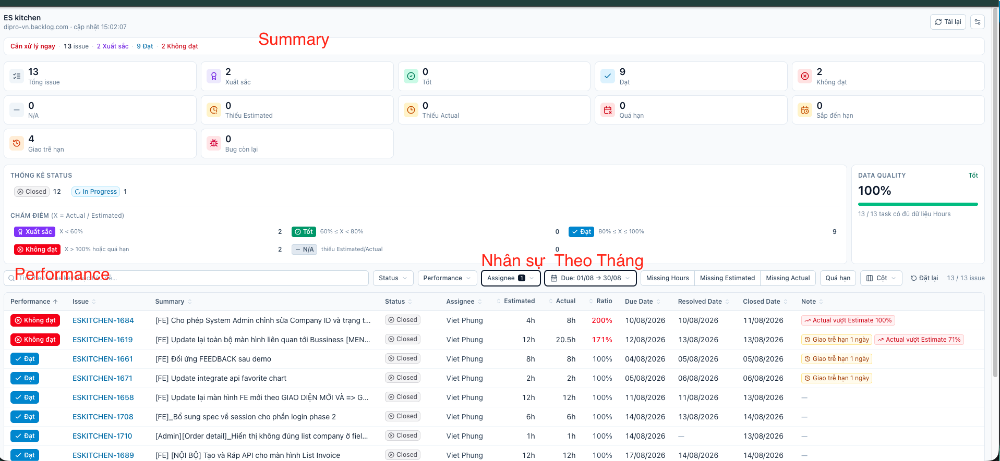
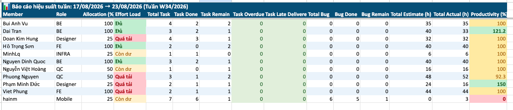
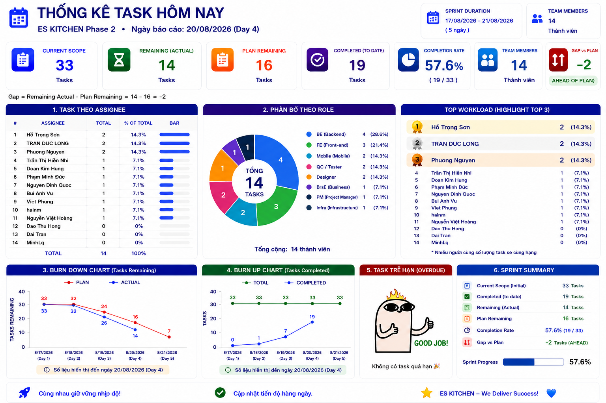
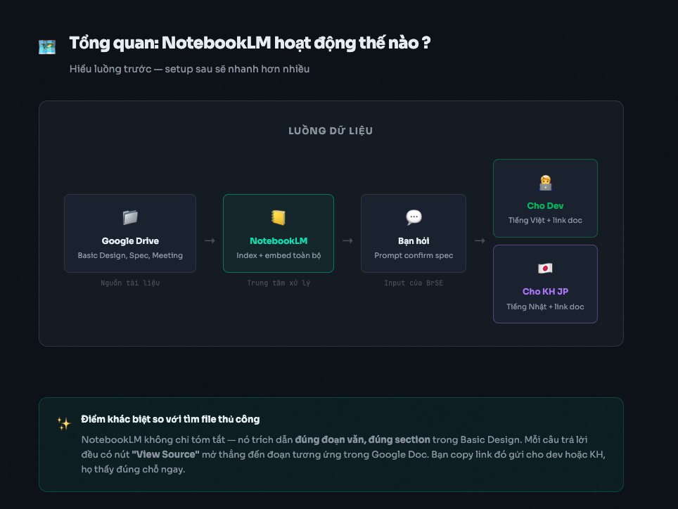

# PM AI Kit

Bộ công cụ AI hỗ trợ **Project Manager** — tự động hóa các đầu việc lặp lại: báo cáo hiệu suất, dashboard sprint, wiki dự án.

## Danh sách tool

| # | Tool | Mục đích | Nền tảng | Hướng dẫn sử dụng |
|---|------|----------|----------|-------------------|
| 1 | [Backlog Performance Extension](./backlog-performance-extension/) | Xem hiệu suất Nhân viên / Sprint ngay trên UI Backlog theo tuần/tháng | Chrome Extension | [HDSD_Backlog_Performance_Extension.docx](https://docs.google.com/document/d/1iQsvAmbhn8-CMpOSf-qUGajgVtR7F9s0/edit) |
| 2 | [Performance Report](./performance-report/) | Xuất Excel 5 sheets đánh giá hiệu suất member từ Backlog API | Claude Code + Python | [Hướng dẫn tạo performance report theo tuần](https://docs.google.com/document/d/1jbm825Ff5M11J6QTQMPtw_pE62gQdg8k93SnC3pAi-w/edit?tab=t.0) |
| 3 | [Task Dashboard](./task-dashboard/) | Tạo 1 ảnh dashboard PMO (KPI + Burndown + Burnup + Overdue) | GPT / ChatGPT (free) | [Hướng dẫn tạo Daily Report tổng quan](https://github.com/dipro-vn/dipro-ai-boost/blob/main/ai-tips/huong-dan-daily-report-tong-quan/H%C6%B0%E1%BB%9Bng%20d%E1%BA%ABn%20t%E1%BA%A1o%20Daily%20Report%20t%E1%BB%95ng%20quan.md) |
| 4 | [NotebookLM](./notebooklm/) | "Wikipedia cho dự án" — chatbot AI trả lời câu hỏi từ tài liệu dự án, auto-refresh source, vẽ mindmap | Google NotebookLM (web) | [NotebookLM workflow](https://drive.google.com/file/d/1AupboF1ij3CbaIFj1YicUWjPOeKeNLLJ/view?usp=sharing) |

---

## Preview từng tool

### 1. Backlog Performance Extension

Xem hiệu suất Nhân viên / Sprint ngay trên UI Backlog theo tuần/tháng.

→ [Chi tiết](./backlog-performance-extension/) · [Hướng dẫn cài đặt](https://docs.google.com/document/d/1iQsvAmbhn8-CMpOSf-qUGajgVtR7F9s0/edit)

---

### 2. Performance Report

Xuất Excel 5 sheets (Dashboard tuần / Monthly / Availability / Action Required / Raw Data) đánh giá hiệu suất member từ Backlog API.

→ [Chi tiết](./performance-report/) · [Hướng dẫn tạo performance report theo tuần](https://docs.google.com/document/d/1jbm825Ff5M11J6QTQMPtw_pE62gQdg8k93SnC3pAi-w/edit?tab=t.0)

---

### 3. Task Dashboard

Tạo 1 ảnh dashboard PMO (KPI + Burndown + Burnup + Overdue) từ dữ liệu sprint bằng GPT free.

→ [Chi tiết](./task-dashboard/) · [Hướng dẫn tạo Daily Report tổng quan](https://github.com/dipro-vn/dipro-ai-boost/blob/main/ai-tips/huong-dan-daily-report-tong-quan/H%C6%B0%E1%BB%9Bng%20d%E1%BA%ABn%20t%E1%BA%A1o%20Daily%20Report%20t%E1%BB%95ng%20quan.md)

---

### 4. NotebookLM

"Wikipedia cho dự án" — chatbot AI trả lời câu hỏi từ tài liệu dự án, auto-refresh source, vẽ mindmap tổng quan.

→ [Chi tiết](./notebooklm/) · [NotebookLM workflow](https://drive.google.com/file/d/1AupboF1ij3CbaIFj1YicUWjPOeKeNLLJ/view?usp=sharing)

---

## Chọn tool nào?

| Nhu cầu | Dùng |
|---------|------|
| "Muốn xem nhanh hiệu suất member trên trang Backlog" | **Backlog Performance Extension** |
| "Cần Excel chi tiết theo tuần/tháng để gửi BOD" | **Performance Report** |
| "Cần ảnh dashboard đẹp để dán vào slide daily/weekly" | **Task Dashboard** |
| "Muốn có 'wiki AI' để member hỏi đáp về dự án, onboard người mới" | **NotebookLM** |
