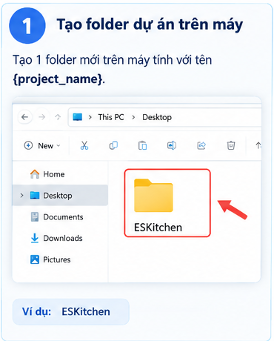
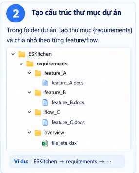
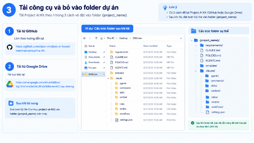
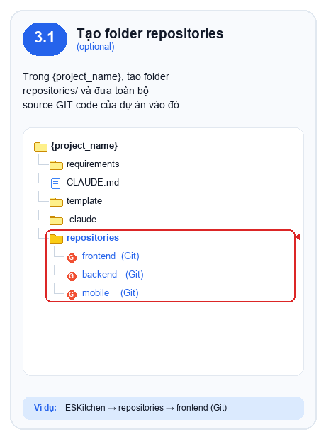
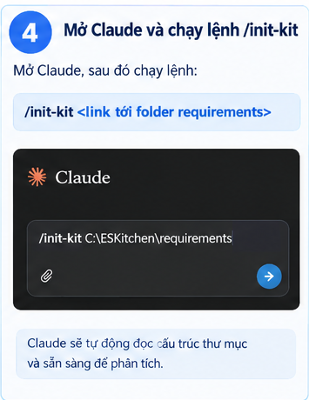
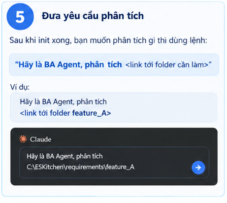
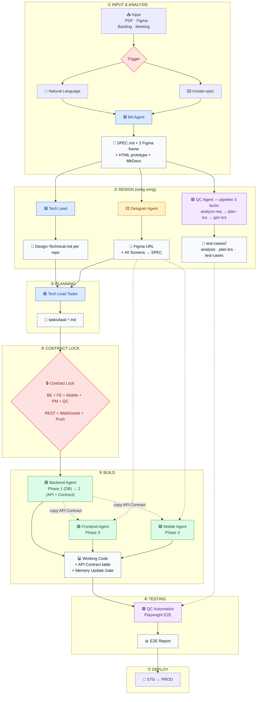

# project-ai-kit — Template BMAD Agent Kit

> Bộ khung multi-agent AI (BA → Tech Lead → Designer → QC → Dev → QC Automation) theo mô hình BMAD. Pull kit này vào 1 dự án mới, bỏ repo source code vào đúng chỗ, chạy 1 lệnh setup, là có ngay bộ agent/command/skill hoạt động cho toàn bộ vòng đời feature (SPEC → DESIGN → task → implement → E2E test → deploy).

---

## Quy trình từ A → Z

### Bước 0 — Cài & đăng nhập Claude Code CLI

Kit này chạy trên **Claude Code CLI** — cần cài 1 lần trước khi làm gì.

**Yêu cầu:** Node.js ≥ 18 (khuyến nghị dùng `nvm`).

```bash
# Cài Claude Code CLI (global)
npm install -g @anthropic-ai/claude-code

# Kiểm tra
claude --version
```

**Đăng nhập lần đầu:**

```bash
claude    # chạy tại thư mục bất kỳ
```

---

### Bước 1 — Chuẩn bị thư mục dự án mới

Tạo folder chứa dự án



### Bước 2 — Chuẩn bị thư mục dự án mới

Tạo folder requirements và chia tài liệu theo từng Feature / Flow.

```
•	ESKitchen/
•	└── requirements/
•	    ├── feature_A/ → feature_A.docs
•	    ├── feature_B/ → feature_B.docs
•	    ├── flow_C/    → feature_C.docs
•	    └── overview/  → file_eta.xlsx
```



### Bước 3 — Copy kit vào dự án

Cách 1:

```bash
# Từ thư mục chứa project-ai-kit (đổi <path-to-kit> cho đúng)
cp -r <path-to-kit>/project-ai-kit/.claude ./.claude
cp -r <path-to-kit>/project-ai-kit/template ./template    # Excel templates cho QC
cp <path-to-kit>/project-ai-kit/CLAUDE.md <path-to-kit>/project-ai-kit/POLICIES.md <path-to-kit>/project-ai-kit/AGENTS.md ./
```

Cách 2: Tải từ Google Drive: https://drive.google.com/drive/folders/1sgT97wFsHa3elb9cOkFsjN9ldt8wsm4Q?usp=sharing

Sau khi tải:

```
•	{project_name}/
•	├── requirements/
•	├── CLAUDE.md
•	├── POLICIES.md
•	├── AGENTS.md
•	├── template/
•	└── .claude/
•	    ├── agents/  commands/  skills/  context/
•	    ├── rules/   scripts/   workflows/
•	    └── settings.json
```



### Bước 3.1 — Bỏ repo source code vào (Optional) : Nếu chưa có bỏ qua

Trong {project_name}, tạo folder repositories/ và đưa toàn bộ source GIT code của dự án vào đó.

```
 {project_name}/
 ├── requirements/
 ├── CLAUDE.md
 ├── POLICIES.md
 ├── AGENTS.md
 ├── template/
 ├── .claude/
 └── repositories/          ← MỚI (optional)
     ├── frontend/    (Git)
     ├── backend/     (Git)
     └── mobile/      (Git)
```



### Bước 4 — Chạy setup 1 lần: `/init-kit`

Mở Claude Code tại thư mục chứa `AGENTS.md` và `.claude/` (`agentsRoot`), sau đó nhập trong session:

```
•	/init-kit <link tới folder requirements>
•	Ví dụ: /init-kit C:\ESKitchen\requirements

```

Lưu ý: Sử dụng đường dẫn thực tế tới folder requirements trên máy.

(hoặc nói tự nhiên: "hãy chạy init kit cho dự án này")

`/init-kit` là slash command của Claude Code, không phải command shell. Với
project được tạo bằng Dipro AI Boost, app tự mở terminal Claude
trong modal và gửi lệnh này; người dùng trả lời các câu hỏi ngay trong app.
Project có sẵn vẫn có thể dùng handoff:

```bash
cd "<agentsRoot>"
claude
```

Sau khi Claude Code mở, nhập `/init-kit` hoặc dùng tên project làm ngữ cảnh:

```text
/init-kit Tên dự án: <ten-du-an>
```

`init-agent` sẽ hỏi ~8 câu — **trả lời dựa trên cấu trúc thư mục đã tạo ở Bước 3**:

1. Tên dự án + mô tả domain nghiệp vụ 1-2 câu
2. Docs root — path thật tới nơi chứa SPEC/DESIGN/PLAN (ví dụ `<ten-du-an>-docs/docs` nếu dùng Cách A, hoặc `docs` nếu dùng Cách B)
3. Danh sách repo: tên, **đường dẫn tương đối thật** (ví dụ `<ten-du-an>-repository/<backend-repo>`), vai trò (`backend`/`frontend`/`mobile`/`other`), stack (Enter để dùng mặc định kit)
4. Danh sách actor/persona nghiệp vụ (ai dùng hệ thống, dùng repo nào)



s

### Bước 5 — Bắt đầu vòng đời feature đầu tiên

"hãy là BA, làm SPEC cho \<requirement\>". Từ đây pipeline BMAD tự dẫn dắt qua "Bước tiếp theo" ở cuối mỗi output — không cần nhớ thứ tự lệnh:

```
Claude sẽ hỏi thêm một số thông tin để xác định Output mong muốn.
•	Link FIGMA cần cho Output
•	Sử dụng cho WebApp, App hay Website
•	Một số câu hỏi bổ sung khác về user, flow, responsive, UI tham khảo...
Lưu ý: Cung cấp đầy đủ thông tin để BA Agent tạo Output phù hợp.
```



**Shortcut chạy cả pipeline 1 lệnh :**

```
/create-feature <feature> [mô tả]     # Planning: BA → Design → Tasks, dừng ở gate để review
/create-feature <feature> build       # Build: Dev → QC Automation, chạy sau khi đã duyệt Planning
```

**Sơ đồ pipeline BMAD — từ yêu cầu đến deploy:**



## Tham Khảo

[VIDEO DEMO](https://drive.google.com/file/d/10475WFEabgLh0-yTJkNLjPYNldgKghkC/view?usp=sharing)
