# Dipro AI Boost

> Desktop app (Tauri + React) chạy pipeline BMAD của `project-ai-kit` bằng UI thay vì gõ tay từng slash command trong Claude Code CLI — Pipeline Board hiển thị 8 stage / 9 agent, bấm Run/Skip/Kill/Retry cho từng agent, theo dõi log theo thời gian thực.

> Guide A→Z cho **kit** (agent/command/skill, quy trình feature SPEC → DESIGN → task → implement → E2E test → deploy) nằm ở [`../README.md`](../README.md). File này chỉ nói về **app**: cài, chạy, và setup 1 project để dùng được.

---

## Mục lục

1. [Yêu cầu hệ thống](#1-yêu-cầu-hệ-thống)
2. [Cài & chạy app](#2-cài--chạy-app)
3. [Chuẩn bị thư mục project](#3-chuẩn-bị-thư-mục-project)
4. [Mở project trong app](#4-mở-project-trong-app)
5. [Chạy `/init-kit`](#5-chạy-init-kit)
6. [Cấu hình MCP Figma](#6-cấu-hình-mcp-figma)
7. [Tạo feature đầu tiên & chạy pipeline](#7-tạo-feature-đầu-tiên--chạy-pipeline)
8. [Mở lại project đã setup](#8-mở-lại-project-đã-setup)
9. [Ghi chú vận hành](#9-ghi-chú-vận-hành)

---

## Toàn cảnh luồng setup

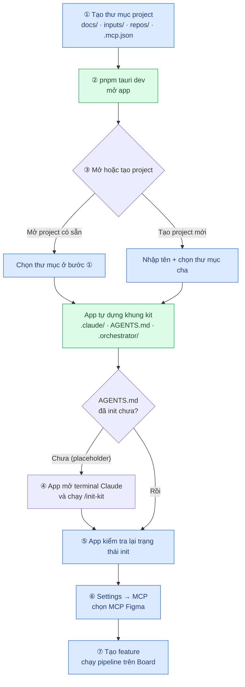

Ô xanh dương = việc bạn làm · ô xanh lá = app tự làm.

---

## 1. Yêu cầu hệ thống

| Thành phần | Bắt buộc | Ghi chú |
|---|---|---|
| Node.js ≥ 18 + pnpm | ✅ | `npm install -g pnpm` nếu chưa có |
| Rust toolchain (stable) | ✅ | Tauri build backend bằng Cargo — cài qua [rustup.rs](https://rustup.rs) |
| Claude Code CLI, đã login | ✅ | App **spawn** `claude` CLI để chạy từng agent, không tự gọi model. Chưa cài → xem [`../README.md`](../README.md) Bước 0 |
| macOS: Xcode Command Line Tools | ✅ (macOS) | `xcode-select --install` |
| Linux: `webkit2gtk` + gói dev Tauri | ✅ (Linux) | Xem [Tauri prerequisites](https://tauri.app/start/prerequisites/) theo distro |
| MCP server phục vụ Figma | ⬜ optional | Chỉ cần khi dùng stage ② Design Analyst — xem [mục 6](#6-cấu-hình-mcp-figma) |

Kiểm tra nhanh trước khi bắt đầu:

```bash
node -v && pnpm -v && cargo --version && claude --version
```

---

## 2. Cài & chạy app

```bash
cd project-ai-kit/orchestrator-app
pnpm install
pnpm tauri dev
```

`pnpm tauri dev` mở cửa sổ desktop và hot-reload cả frontend (Vite) lẫn backend (Rust tự rebuild + restart). Lần chạy đầu Cargo phải build từ đầu — **mất vài phút**, lần sau nhanh hơn nhiều.

Build bản cài đặt được:

```bash
pnpm tauri build
```

> `pnpm dev` (không qua `tauri`) chỉ chạy Vite dev server cho phần frontend — sửa UI nhanh mà không rebuild Rust, nhưng **không mở được cửa sổ desktop thật** vì không có backend Tauri phía sau.

Chạy test:

```bash
pnpm test                 # vitest — logic frontend
(cd src-tauri && cargo test)   # toàn bộ backend Rust
```

---

## 3. Chuẩn bị thư mục project

App **không** tạo repo hộ bạn — nó trỏ vào một thư mục project đã có trên máy. Tạo trước cấu trúc tối thiểu:

```bash
mkdir -p project-example/{docs,inputs,repos}
cd project-example
```

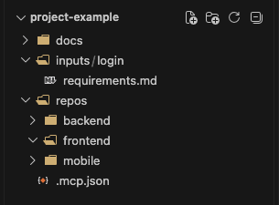

Trong ảnh trên:

| Thư mục / file | Vai trò | Bắt buộc? |
|---|---|---|
| `docs/` | **DOCS_ROOT** — sẽ chứa `features/<tên feature>/` (SPEC, DESIGN, tasks) | ✅ |
| `repos/` | **Repository root** — `git clone` từng repo source thật vào đây (`backend`, `frontend`, `mobile`...) | ✅ |
| `inputs/<feature>/` | Tài liệu đầu vào cho BA (`requirements.md`, biên bản họp, mô tả màn hình...) | ⬜ tạo sau cũng được |
| `.mcp.json` | Khai báo MCP server của project (Figma, tilth...) — xem [mục 6](#6-cấu-hình-mcp-figma) | ⬜ |

Thư mục gốc (`project-example/`) chính là **Agents root** — nơi kit sẽ "sống".

> **3 root không bắt buộc lồng nhau.** Bố cục trên chỉ là quy ước gọn cho project mới. Bạn có thể để Agents root + DOCS_ROOT trong một repo docs riêng và Repository root ở chỗ hoàn toàn khác — app validate độc lập từng root, không giả định quan hệ cha-con.

Clone repo source vào `repos/` **trước khi** chạy `/init-kit` ở mục 5 — `init-agent` sẽ hỏi tên và vai trò của từng repo, có sẵn thư mục thì trả lời chính xác hơn.

---

## 4. Mở project trong app

### 4.1. Màn hình Launcher

Mở app lần đầu, chưa có project nào:

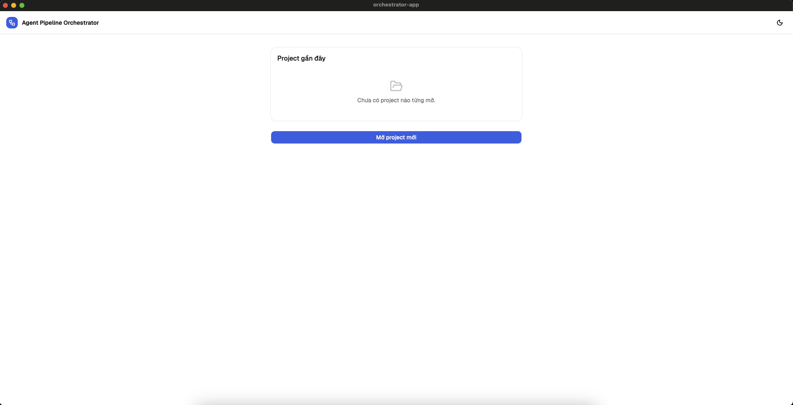

    Có hai lựa chọn:

    - **Mở project mới** — chọn một thư mục project có sẵn, sau đó xác nhận 3 root độc lập.
    - **Tạo project mới** — nhập tên project và chọn thư mục cha; app tự tạo layout chuẩn rồi mở terminal init-kit trong app.

### 4.2. Chọn thư mục gốc

Hộp thoại chọn thư mục hiện ra — trỏ vào thư mục đã tạo ở [mục 3](#3-chuẩn-bị-thư-mục-project) (ở đây là `project-example`) rồi bấm **Open**:

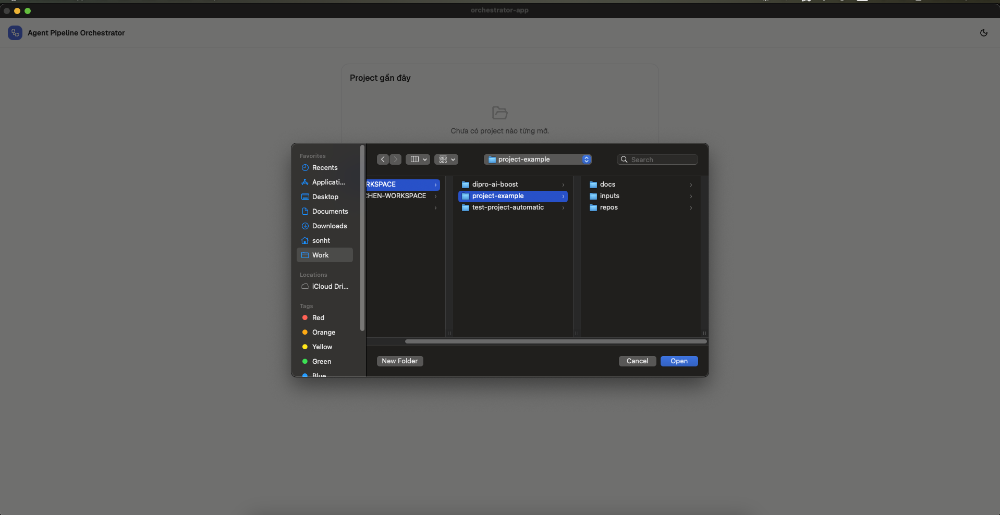

App dùng path này để **gợi ý** 3 root (không đoán bừa): nếu thấy sẵn `AGENTS.md` / `docs/` / repo đã clone thì điền luôn. Sang form **Mở project**:

1. Điền **Tên project**.
2. Với 3 field path, chọn 1 trong 2 cách:
   - Bấm từng nút **Chọn thư mục** để browse riêng, hoặc gõ tay.
   - Hoặc bấm **Dùng bố cục mặc định** — tự điền `agentsRoot = <root>`, `docsRoot = <root>/docs`, `repositoryRoot = <root>/repos`.
3. Thư mục chưa tồn tại cũng không sao — hint *"Chưa có cũng được — app sẽ tạo thư mục khi mở"* nghĩa đúng như vậy.
4. Bấm **Mở project**.

### 4.3. App tự dựng khung kit

Ngay khi mở, app tự động:

- Tạo 3 thư mục nếu chưa có.
- **Copy toàn bộ khung kit** vào `agentsRoot`/`docsRoot`: `.claude/` (agents · commands · skills · rules · workflows · hooks), `CLAUDE.md`, `POLICIES.md`, `AGENTS.md` (bản placeholder), skeleton `docs/features/`.
- Tạo `.orchestrator/` — state nội bộ của app (xem [mục 9](#9-ghi-chú-vận-hành)).

### 4.4. Tạo project mới hoàn toàn trong app

Từ Launcher, bấm **Tạo project mới**, nhập tên và chọn thư mục cha. App tạo
`<thu-muc-cha>/<ten-project>/` với `docs/features/`, `repos/`, `.claude/` và
`.orchestrator/`, sau đó mở một terminal Claude ngay trong app và tự gửi
`/init-kit Tên dự án: <ten-project>`.

Terminal là interactive: các câu hỏi về domain, repo, actor và stack của
`init-agent` vẫn cần người dùng trả lời, nhưng không cần mở terminal bên ngoài
hoặc gõ lệnh init-kit thủ công. Có thể ẩn terminal và mở lại trong lúc session
đang chạy; nút **Dừng init-kit** kết thúc session.

Không cần `cp -r` tay như luồng CLI thuần ở [`../README.md`](../README.md) Bước 2 nữa.

So sánh thư mục **trước** ([ảnh mục 3](#3-chuẩn-bị-thư-mục-project)) và **sau** khi mở trong app — `.claude/`, `.orchestrator/`, `AGENTS.md`, `CLAUDE.md`, `POLICIES.md` là do app tạo:

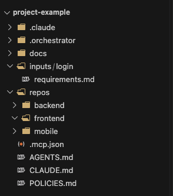

Trong app, bạn vào thẳng Pipeline Board — cột **Workflow** còn trống vì chưa có feature nào:

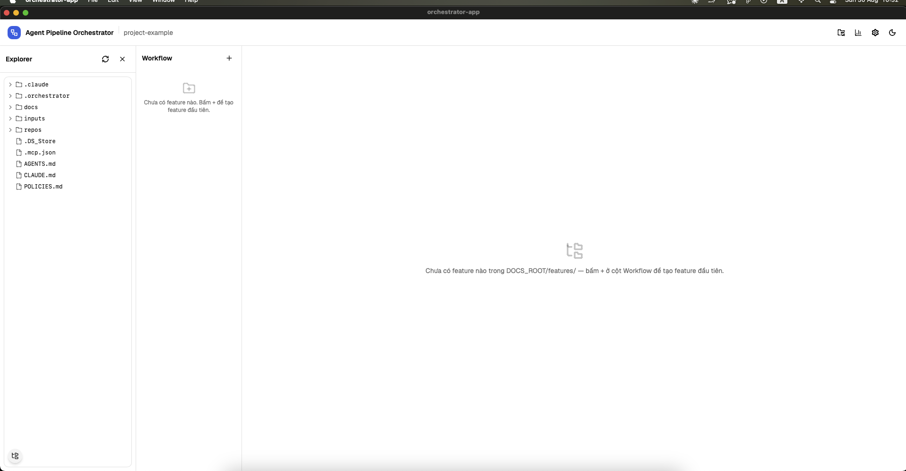

- **Explorer** (trái) — duyệt file của project ngay trong app; bật/tắt bằng icon góc dưới trái.
- **Workflow** (giữa) — danh sách feature, bấm `+` để tạo.
- Góc trên phải, từ trái sang: **Đổi project** · **Cost & Reports** · **Settings** · **đổi theme sáng/tối**.

> Dựng khung kit thất bại (ví dụ thư mục read-only) → app báo warning kèm nút **Bổ sung khung kit** để thử lại, không cần đóng project.

---

## 5. Chạy `/init-kit`

Với project đã có sẵn được mở từ Launcher, `AGENTS.md` có thể vẫn là
**placeholder** — chưa biết tên repo thật, vai trò, stack, actor nghiệp vụ.
App phát hiện và chặn lại ở màn hình này:

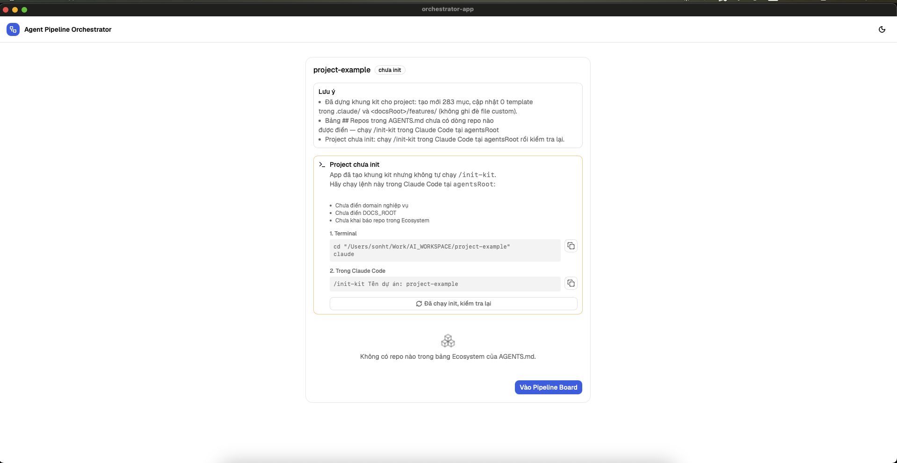

Màn hình nêu rõ **thiếu cái gì** (chưa điền domain nghiệp vụ, chưa điền DOCS_ROOT, chưa khai repo trong Ecosystem) và cho sẵn 2 khối lệnh **copy-paste được** (bấm icon copy bên phải):

```bash
# 1. Terminal
cd "/đường/dẫn/tới/project-example"
claude
```

```
# 2. Trong Claude Code
/init-kit Tên dự án: project-example
```

`init-agent` chạy và hỏi bạn (project mới sẽ hỏi trong terminal modal của app;
project có sẵn vẫn có thể dùng handoff bên ngoài):

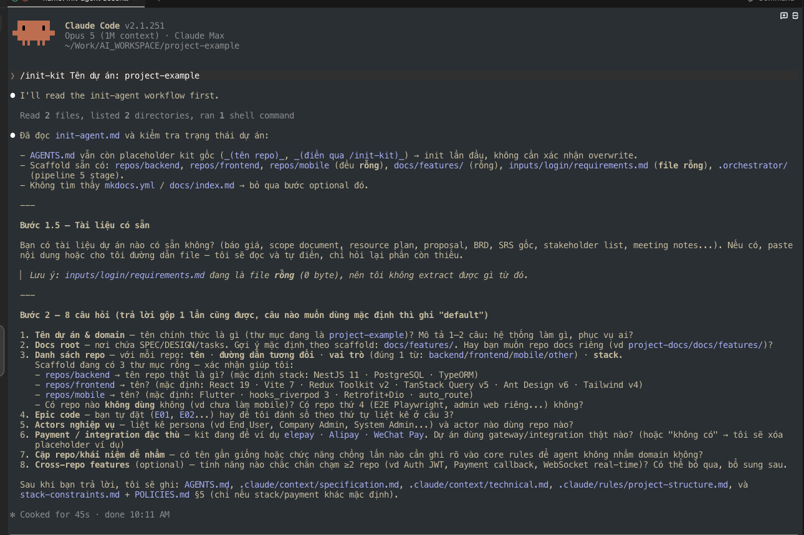

- **Bước 1.5** — có sẵn tài liệu dự án nào không (báo giá, scope doc, BRD, SRS, meeting notes...). Có thì paste vào hoặc đưa đường dẫn, agent tự đọc và điền, chỉ hỏi lại phần còn thiếu.
- **Bước 2 — 8 câu hỏi**: tên dự án & domain · docs root · danh sách repo (tên · path · vai trò · stack) · epic code · actors nghiệp vụ · payment/integration · cặp khái niệm dễ nhầm · cross-repo features.

> Trả lời gộp 1 lần cũng được. Câu nào muốn dùng mặc định thì ghi `default`.

Xong, agent ghi vào `AGENTS.md`, `.claude/context/specification.md`, `.claude/context/technical.md`, `.claude/rules/project-structure.md`, `stack-constraints.md` và `POLICIES.md` §5.

**Quay lại app**, bấm **Đã chạy init, kiểm tra lại**. App đọc lại `AGENTS.md`, parse bảng `## Repos` thành Ecosystem:

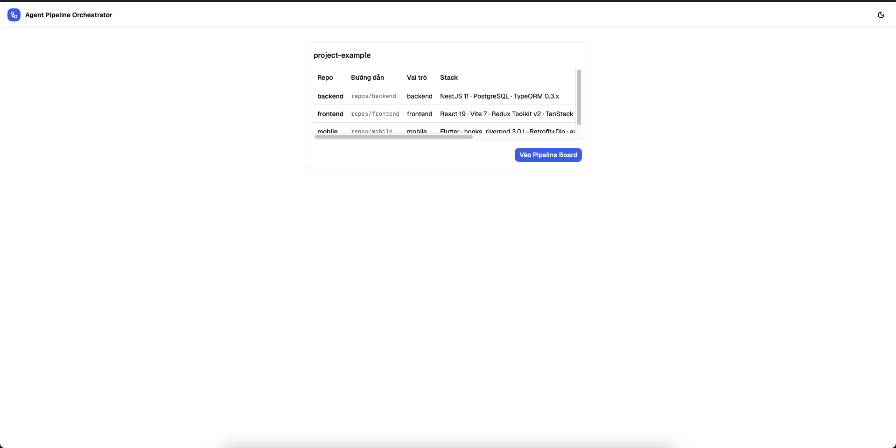

Thấy đúng repo · đường dẫn · vai trò · stack là xong. Bấm **Vào Pipeline Board**.

<details>
<summary>Vẫn còn báo "chưa init"? 3 nguyên nhân thường gặp</summary>

- Bảng `## Repos` trong `AGENTS.md` vẫn còn dòng placeholder → chạy lại `/init-kit`.
- Repo khai trong `AGENTS.md` không tìm thấy trên đĩa → kiểm tra `repositoryRoot`, hoặc clone repo còn thiếu.
- Ô **Vai trò** của một repo không đọc được (phải đúng 1 từ: `backend` / `frontend` / `mobile` / `other`) → sửa tay trong `AGENTS.md`.

App luôn nêu lý do cụ thể trong warning, không im lặng bỏ qua.
</details>

---

## 6. Cấu hình MCP Figma

Bước này chỉ cần khi bạn dùng nhánh **② Design Analyst** (đọc design Figma có sẵn) hoặc muốn Frontend/Mobile đọc lại design khi code UI. Bỏ qua được nếu dự án không có Figma.

### 6.1. Khai báo server

Khai MCP server trong `.mcp.json` hoặc `.claude/settings.json` tại `agentsRoot` (app cũng đọc ngược lên tối đa 4 cấp thư mục cha, nên khai ở workspace gốc vẫn nhận):

```json
{
  "mcpServers": {
    "figma-bridge": {
      "command": "npx",
      "args": ["-y", "mcp-figma-bridge"],
      "env": { "BRIDGE_PORT": "3765", "BRIDGE_HOST": "127.0.0.1" }
    }
  }
}
```

App tự nhận diện server phục vụ Figma bằng **cấu hình thật** (tên / command / url có chứa `figma`), không giả định tên cố định.

### 6.2. Chọn server trong Settings

Vào **Settings → tab MCP**. Bảng *"Khai báo trong project"* liệt kê mọi server đọc được, cột cuối đánh dấu cái nào phục vụ Figma. Ngay dưới bảng, app cho biết server nào đang được dùng:

> Stage Design và Build sẽ dùng MCP `figma-bridge`.

Có **từ 2 server Figma trở lên** → cột phải hiện radio **"dùng cho stage Design"** để bạn chọn. Chỉ 1 server thì app tự dùng cái đó, không cần chọn.

### 6.3. ⚠️ Cảnh báo "Agent chưa khai tool của MCP …"

`tools:` trong file agent (`.claude/agents/*.md`) là **allowlist**: tool không nằm trong đó thì agent **không gọi được**, dù MCP server đã kết nối và khoẻ. Kit khai sẵn tool cho đúng 2 server: `figma-bridge` và `claude.ai Figma`.

Project dùng MCP Figma tên khác (ví dụ `figma`, `figma-mcp-go`) → Settings hiện Alert đỏ nêu đích danh file agent nào còn thiếu, kèm tiền tố tool cần thêm. Khi đó:

- **Design Analyst bị chặn** (không spawn) kèm lý do rõ ràng — thay vì chạy rồi mọi lời gọi Figma bị từ chối âm thầm.
- **Frontend / Mobile vẫn chạy bình thường**, chỉ không gọi Figma MCP mà dựa vào `design-analysis.md` + `design-resources/` + `screenshot-design/` mà Design Analyst đã để lại.

Cách xử lý — chọn 1 trong 2:

1. Thêm các tool **ĐỌC** của server đó vào `tools:` của `design-analyst-agent.md`, `frontend-agent.md`, `mobile-agent.md`. Tên tool là `mcp__<tên server>__<tên tool>`, trong đó mọi ký tự ngoài `[A-Za-z0-9_-]` của tên server đổi thành `_` (`claude.ai Figma` → `claude_ai_Figma`, `figma-bridge` giữ nguyên).
   > Tuyệt đối **không** thêm tool ghi (`create_*` / `set_*` / `delete_*`) — các agent này chỉ được đọc Figma.
2. Hoặc đổi sang MCP Figma khác ở radio trong Settings.

---

## 7. Tạo feature đầu tiên & chạy pipeline

### 7.1. Tạo feature

Ở cột **Workflow**, bấm `+`, gõ tên feature (chữ thường, số, dấu gạch ngang), bấm **Tạo**:

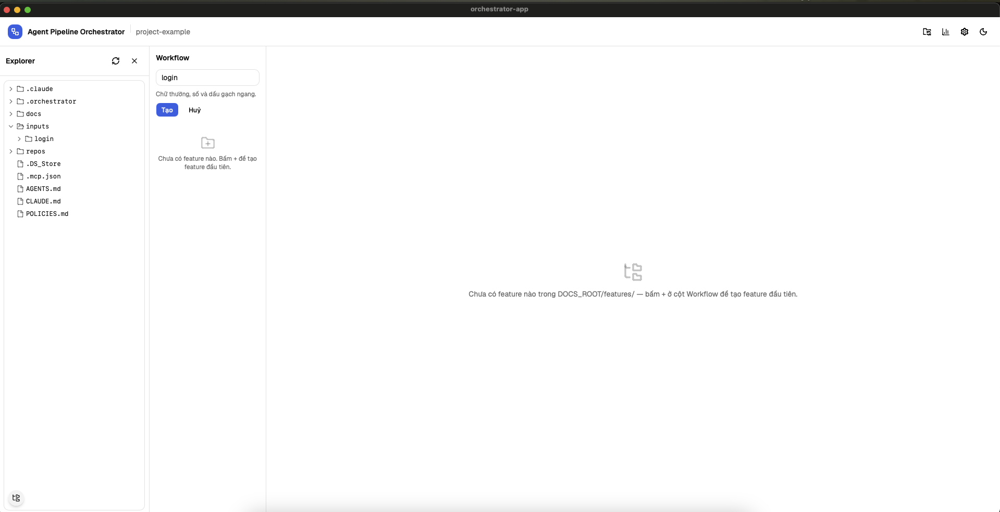

App tạo `docs/features/<tên feature>/` và vẽ pipeline tree cho feature đó.

### 7.2. Pipeline — 8 stage, 9 agent

```
DISCOVERY
  ① Input ──────────── BA · SPEC                          (ba-agent)
  🚦 Trigger Gate ──── duyệt tay trước khi vào Design

DESIGN
  ② Design ─────────── Tech Lead · Design                 (techlead-design-agent)
                    ├─ Design Analyst                     (design-analyst-agent)
                    └─ QC · Test Cases                    (qc-agent)

PLANNING & CONTRACT
  ③ Planning ───────── Tech Lead · Tasks                  (techlead-tasks-agent)
  ④ Contract Lock ──── confirm BE + FE + Mobile + PM + QC

BUILD
  ⑤ Build ──────────── Backend                            (backend-agent)
                    ├─ Frontend  (chờ Backend)            (frontend-agent)
                    └─ Mobile    (chờ Backend)            (mobile-agent)

TEST & RELEASE
  ⑥ Testing ────────── QC · Automation                    (qc-automation-agent)
  ⑦ Deploy ─────────── checklist thủ công
```

3 agent của stage ② chạy **song song**; Frontend/Mobile chờ Backend xong (cần API Contract). 2 node gate (🚦 Trigger, ④ Contract Lock) **không phải agent** — bấm vào để duyệt tay.

### 7.3. Chạy agent đầu tiên (BA)

Click node **BA · SPEC** → panel bên phải hiện form:

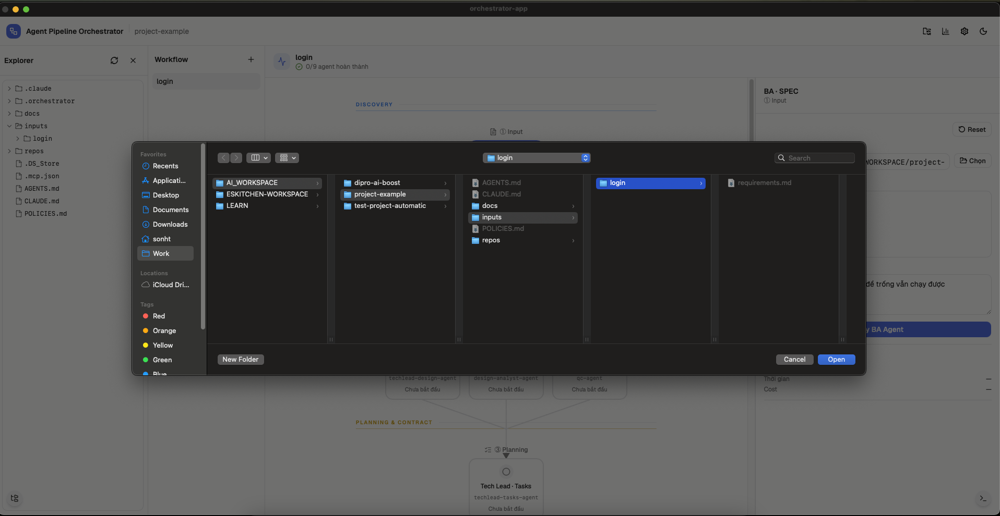

1. Bấm **Chọn** → trỏ vào thư mục tài liệu đầu vào của feature (ở đây là `inputs/login/`). App copy toàn bộ folder vào `.orchestrator/inputs/<run-id>/` để agent đọc, **không** đọc trực tiếp từ chỗ bạn chọn.
2. Ô ghi chú (*"Ghi chú thêm cho BA Agent, để trống vẫn chạy được"*) — thêm context nếu cần.
3. Bấm **Chạy BA Agent**.

Header feature hiển thị tiến độ dạng `0/9 agent hoàn thành`.

### 7.4. Theo dõi & điều khiển

- Node đang chạy có vòng sáng; bấm icon **Agent terminals** (góc dưới phải) để mở dock log realtime.
- Mỗi node có **Run** / **Kill** / **Skip** / **Retry** / **Resume** tuỳ trạng thái.
- Agent dừng hỏi → node chuyển `waiting-input`, panel hiện ô trả lời, gửi xong agent chạy tiếp **trong cùng session**.
- Node `done` hiện danh sách artifact vừa sinh — click để mở trong Viewer.

> **App không tự chạy agent nào.** Mọi run đều do bạn bấm, kể cả sau khi qua gate/lock.

### 7.5. Riêng node Design Analyst

Node này có thêm ô **"URL Figma (selection)"** trước nút Run. Dán link (chuột phải vào frame trong Figma → *Copy link to selection*) rồi Run — agent dùng luôn URL đó, không dừng lại hỏi.

URL được **lưu theo feature** vào `.orchestrator/design-refs/<feature>.json`:

- Lần sau mở lại node, ô nhập tự điền lại URL đã lưu — không phải đi tìm link lần nữa. Dán URL mới thì URL cũ bị ghi đè.
- URL này được **tự động bơm vào prompt** của Frontend/Mobile ở stage ⑤, cùng đường dẫn `design-analysis.md`, `design-resources/`, `screenshot-design/` — để 2 agent đó code UI theo đúng design mà Design Analyst đã phân tích.

Để trống ô URL cũng được — agent sẽ dừng lại hỏi (`waiting-input`), bạn dán URL vào ô trả lời, app vẫn lưu lại như trên.

---

## 8. Mở lại project đã setup

Launcher hiện khối **Project gần đây** — chọn project đã mở trước đó để vào lại.

Khác với luồng "Mở project mới" ở [mục 4](#4-mở-project-trong-app), đường này **không tự tạo thư mục thiếu**: path bị xoá hoặc đổi tên thì app báo lỗi để bạn sửa lại, thay vì âm thầm tạo một project rỗng mới.

---

## 9. Ghi chú vận hành

| Chủ đề | Nội dung |
|---|---|
| **`.orchestrator/`** | State nội bộ của app trong `agentsRoot`: config, log run, snapshot, run history, execution report, design-refs. App tự thêm `.gitignore` cho thư mục này; lỡ commit trước đó → app cảnh báo và gợi ý `git rm -r --cached .orchestrator` |
| **Read-only mode** | `agentsRoot` không có `.claude/agents/` → project vẫn mở được nhưng chỉ xem. Dùng **Bổ sung khung kit** để thoát trạng thái này |
| **Auth Claude CLI** | Mặc định dùng nguyên cách `claude` CLI đã login trên máy (`cli-default`). Đổi sang Subscription / Console / API key riêng trong **Settings → Authentication** nếu tổ chức cần tách credential |
| **1 project / lúc** | App chỉ mở 1 project tại 1 thời điểm — đóng project hiện tại (Kill agent đang chạy nếu có) trước khi mở project khác |
| **Model & permission** | **Settings → Agents** chỉnh model, permission profile, max turns, timeout cho từng agent |
| **Chi phí** | **Cost & Reports** (icon biểu đồ trên top bar) tổng hợp chi phí theo feature / stage / agent, export CSV được |
| **Pipeline thay đổi** | Topology pipeline lưu ở `.orchestrator/pipeline.json`. App tự migrate khi bản mới đổi cấu trúc, backup file cũ thành `pipeline.json.v<N>.bak` |

---

## Tham khảo

- [`../README.md`](../README.md) — guide A→Z dùng kit bằng Claude Code CLI thuần
- [`../AGENTS.md`](../AGENTS.md) — Ecosystem + BMAD workflow skeleton của project
- [`../ai-agents-workflow.md`](../ai-agents-workflow.md) — bảng audit từng agent: đọc gì · làm gì · output gì
- [`../.claude/commands/README.md`](../.claude/commands/README.md) — danh sách slash command đầy đủ
